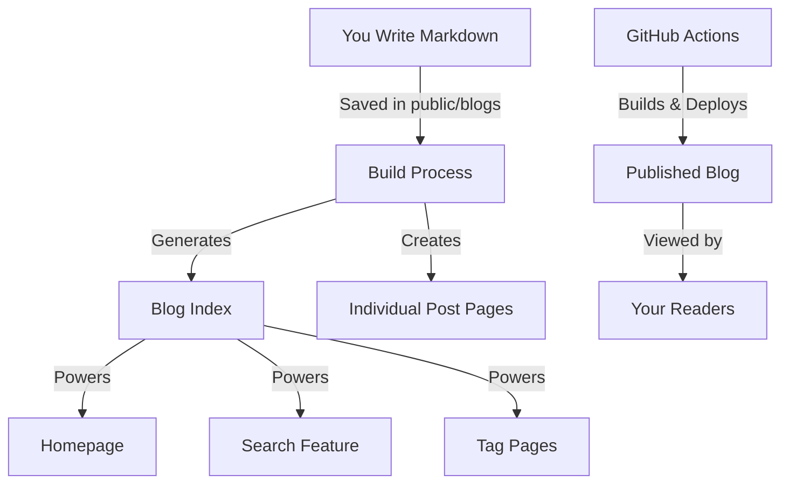
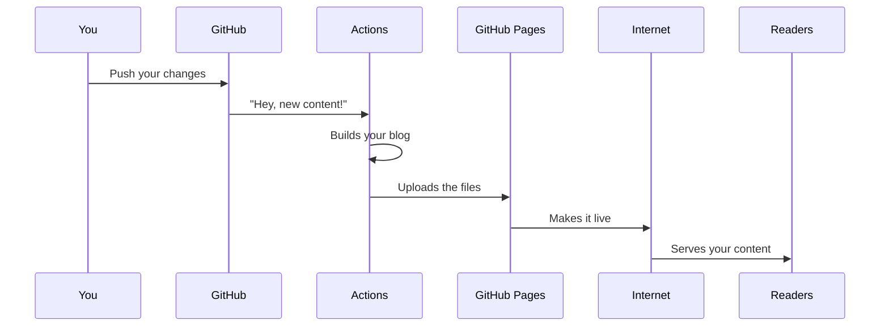
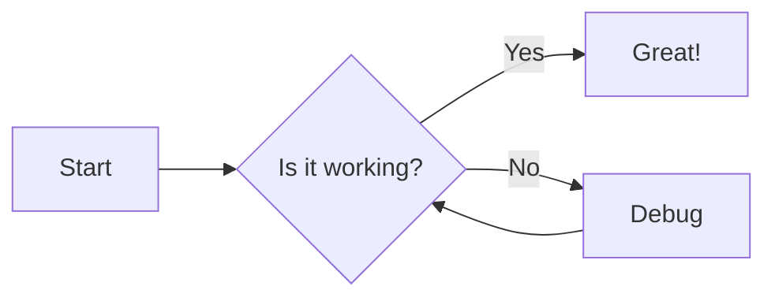

# Building Your Blog with Next.js: A Friendly Guide

Hey there! So you want to create a blog like mine using the Next.js framework? You've made a great choice! This guide will walk you through everything you need to know - from writing your first post to seeing your blog live on the internet. Don't worry if you're new to this; we've designed everything to be straightforward and beginner-friendly.

## What Makes This Blog Framework Special

Before diving into the technical stuff, let's talk about what makes this framework worth your time:

- **Write in Markdown** - Just focus on your content, no HTML expertise needed
- **Beautiful on All Devices** - Thanks to Tailwind CSS, your blog will look great on phones, tablets, and desktops
- **Dark Mode Built-in** - Easy on the eyes, automatically adjusts to reader preferences
- **Pretty Code Blocks** - If you're sharing code, it'll look professional with syntax highlighting
- **Smart Search Feature** - Readers can easily find what they're looking for
- **Organized with Tags** - Group your posts by topic for better navigation
- **Reading Time** - Automatically shows readers how long each post takes to read
- **SEO Ready** - Google and other search engines will love your blog
- **One-Click Deployment** - Publish to GitHub Pages with zero hassle

## Getting Started: The Basics

If you're ready to jump in, here's what you'll need:

- Node.js installed on your computer (version 14 or newer)
- A GitHub account (for publishing your blog)
- Basic familiarity with the command line (don't worry, we'll keep it simple!)

### Setting Up Your Blog in 3 Easy Steps

1. First, grab a copy of this repository:
   ```bash
   git clone https://github.com/tristanpoland/Blog-Pages my-blog
   cd my-blog
   ```

2. Install everything your blog needs to run:
   ```bash
   npm install
   # or if you prefer yarn
   yarn install
   ```

3. Start up your blog on your computer:
   ```bash
   npm run dev
   # or 
   yarn dev
   ```

That's it! Visit `http://localhost:3000` in your browser, and you should see your blog running locally.

## Understanding Your Blog's Structure

Let's take a quick tour of how everything is organized:

```
├── app/                  # This is where all your pages live
├── components/           # Reusable parts like headers and footers
├── public/               # Images and your blog posts go here
│   └── blogs/            # Your markdown files live here
├── utils/                # Helper functions that make everything work
├── .github/workflows/    # Handles automatic publishing
```

Don't worry about memorizing this - you'll get familiar with it as you go!

## Writing Your First Blog Post

This is the fun part! Creating content for your blog is super simple:

1. Create a new markdown file in the `public/blogs` folder, like `my-first-post.md`

2. At the top of your file, add some details about your post:

```markdown
---
title: "My Amazing First Blog Post"
date: "2025-04-16"
tags: ["getting-started", "blogging"]
excerpt: "Join me as I explore the world of blogging with Next.js!"
---

Hello world! This is my first blog post using this awesome framework...
```

3. Write your post content using Markdown. You can add:
   - **Bold text** with `**asterisks**`
   - *Italic text* with `*single asterisks*`
   - [Links](https://example.com) with `[text](url)`
   - Lists, quotes, headings, and more!

4. Save your file, and it'll automatically appear on your blog's homepage

### Adding Images to Your Posts

Want to include some pictures? Easy! Just:

1. Add your image to the `public` folder
2. Reference it in your post like this:
   ```markdown
   
   ```

### Creating Code Examples

If you're writing about programming, you can add beautiful code blocks:

````markdown
```javascript
// This will look amazing in your blog
function sayHello() {
  console.log("Welcome to my blog!");
}
```
````

## How Your Blog Actually Works (Behind the Scenes)

Let's break down how everything works together - in plain English!

### The Content Journey

Your blog works like this:

1. **You Write Content**: You create markdown files in the `public/blogs` folder

2. **Processing Magic**: When you build your blog, special utilities in the `utils` folder read all your markdown files, extract information like titles and tags, and create a searchable index

3. **Beautiful Presentation**: React components in the `components` folder turn your markdown into beautiful HTML with proper styling

4. **Page Creation**: Next.js creates all the necessary pages - your homepage with a list of posts, individual post pages, search results pages, and tag pages

5. **Publishing**: When you're ready to share with the world, GitHub Actions automatically builds and publishes your blog

Here's how it looks as a diagram:



### The Deployment Magic

Whenever you push changes to your GitHub repository, something cool happens:



1. GitHub detects your changes
2. The workflow in `.github/workflows/deploy.yml` springs into action
3. It sets up the environment, installs dependencies, and builds your blog
4. The built files are automatically deployed to GitHub Pages
5. Your changes are live on the internet!

## Customizing Your Blog

Want to make this blog truly yours? Here are some easy ways to personalize it:

### Site Information

Open `app/layout.jsx` and change:
- The site title
- The site description
- The font choice (if you want)

### Look and Feel

The design uses Tailwind CSS, which makes styling super easy:
- Customize colors in `globals.css`
- Modify component layouts in their respective files
- Add your logo to the header

### Header and Footer

Edit these files to add your own links:
- `components/Header.jsx` - Add navigation links, your logo, etc.
- `components/Footer.jsx` - Add social media links, copyright info

## Publishing Your Blog to the World

Ready to go live? It's incredibly simple:

1. Enable github pages in the `settings` tab of your repo:


2. Push your changes to GitHub:
   ```bash
   git add .
   git commit -m "My blog is ready!"
   git push
   ```

3. The GitHub Actions workflow will automatically:
   - Build your blog
   - Deploy it to GitHub Pages

4. In a minute or two, your blog will be live at `https://yourusername.github.io/your-repo-name`

5. Share your blog link with friends, family, and social media!

### Troubleshooting Common Issues

If something doesn't look right:

- **Posts not showing up?** Check if your markdown frontmatter has the correct format
- **Weird styling?** Make sure your Tailwind classes are applied correctly
- **Deployment problems?** Check the Actions tab in your GitHub repository for error logs

## Advanced Blog Features

Once you're comfortable with the basics, try these cool features:

### Mermaid Diagrams

You can create interactive diagrams right in your posts:

````markdown

````

### Math Equations

Need to share some math? LaTeX equations work too:

```markdown
Inline equation: $E = mc^2$

Block equation:
$$
f(x) = \int_{-\infty}^{\infty} \hat{f}(\xi) e^{2\pi i \xi x} d\xi
$$
```

### Custom Containers

Create special highlighted sections:

```markdown
::: info
This is an info box with important details!
:::
```

## Wrapping Up

And there you have it - your very own blog platform that's modern, fast, and easy to maintain! We've designed this framework to grow with you, whether you're a casual blogger or a tech professional.

Remember, the best blog is the one you actually write for. So go ahead, share your thoughts, knowledge, and experiences with the world!

Happy blogging!

---

P.S. Found this helpful? Consider giving the project a star on GitHub, or even better, contributing back improvements so others can benefit too!
