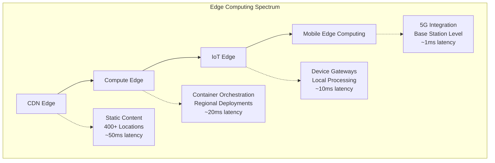
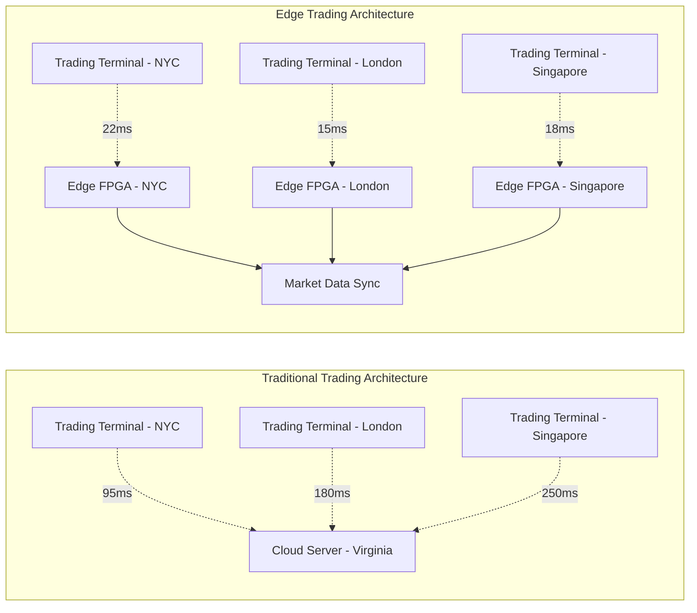
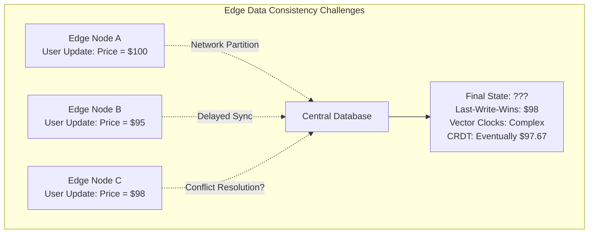
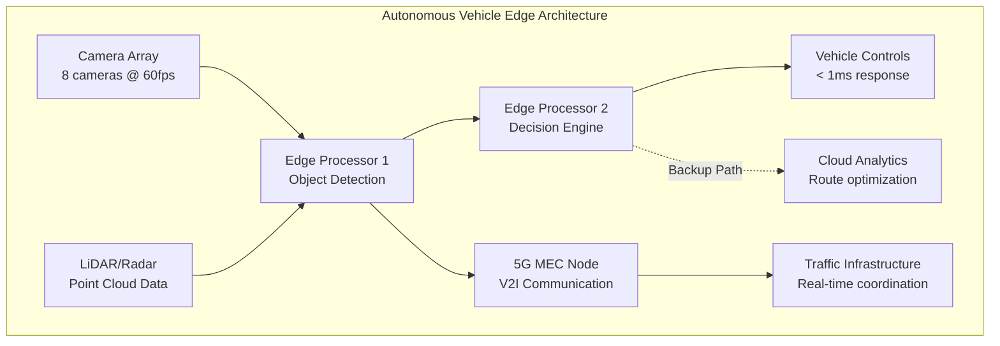
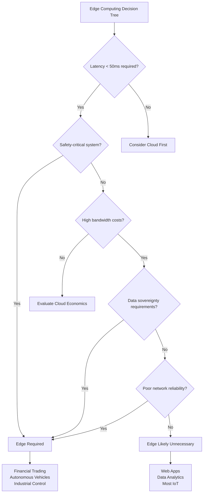

# Edge Computing: Beyond the Buzzword Fog

Edge computing has become the latest Silicon Valley darling, promising to revolutionize everything from autonomous vehicles to smart toasters. But beneath the marketing veneer lies a complex technical reality that's far more nuanced than vendor presentations suggest. After digging through technical papers, real-world deployment data, and industry benchmarks, the picture that emerges is both more modest and more interesting than the hype would have you believe.

**The fundamental promise is simple**: bring computing closer to where data is generated to reduce latency, save bandwidth, and improve performance. The technical reality is considerably more complex, involving distributed systems challenges, operational overhead, and cost trade-offs that often work against the supposed benefits. While edge computing solves genuine problems in specific scenarios, it's frequently deployed as a solution in search of a problem.

Let's dissect what edge computing actually means technically, where it delivers real value, and when it's just expensive buzzword deployment masquerading as innovation.

## What edge computing actually means beyond marketing speak

The most precise technical definition comes from the [European Telecommunications Standards Institute (ETSI)](https://www.etsi.org/technologies/multi-access-edge-computing), which defines Multi-access Edge Computing as "cloud-computing capabilities and an IT service environment at the edge of the network, characterized by ultra-low latency and high bandwidth as well as real-time access to radio network information." This definition cuts through the marketing fluff to focus on the core technical characteristics: **proximity-based processing with specific performance requirements**.

Edge computing isn't a monolithic concept but rather a spectrum of architectures ranging from content delivery networks (the original edge computing) to mobile edge computing integrated with 5G base stations. The technical architecture depends heavily on the specific type of edge deployment, each with distinct characteristics and use cases.

**CDN edge architecture** represents the most mature form of edge computing, with [AWS CloudFront operating 400+ global edge locations](https://aws.amazon.com/cloudfront/features/) and sophisticated caching strategies involving origin servers, regional edge caches, and local edge locations. The architecture pattern follows a clear hierarchy: origin server → regional edge caches → edge locations → end users, with services like Lambda@Edge enabling serverless compute at edge locations for dynamic content processing.

**Compute edge architecture** involves dedicated hardware at edge locations running containerized applications in a microservices architecture. [Google's Distributed Cloud](https://cloud.google.com/distributed-cloud/edge/latest/docs/overview) exemplifies this approach with rack-based deployments featuring GKE clusters on dedicated on-premises hardware, connected via secure Cloud VPN to Google Cloud services. This architecture requires sophisticated container orchestration, typically using lightweight Kubernetes distributions like K3s or MicroK8s optimized for resource-constrained environments.

**IoT edge architecture** follows a hierarchical model: IoT devices → edge gateways → fog nodes → cloud. [Azure IoT Edge](https://azure.microsoft.com/en-us/products/iot-edge) implements this with a containerized runtime managing Docker-compatible modules on edge devices, providing automatic synchronization and configuration management. The communication relies on protocols like MQTT, AMQP, and CoAP for device-to-edge communication.

**Mobile Edge Computing (MEC)** represents the most technically sophisticated form, integrating directly with cellular base stations to provide sub-20ms latency for real-time applications. The [ETSI MEC framework](https://www.etsi.org/technologies/multi-access-edge-computing) includes MEC hosts (physical infrastructure), MEC platforms (software environments), virtualization infrastructure, and MEC orchestrators for lifecycle management. This architecture requires tight integration with 5G networks and network function virtualization.

The technical components underlying these architectures include ruggedized hardware with x86/ARM processors, NVMe SSDs for low-latency access, and network interfaces capable of 10Gbps+ connectivity. Software infrastructure relies on container orchestration, service mesh technologies like Istio for secure service communication, and specialized edge runtime environments optimized for resource constraints.

## Performance benchmarks reveal the real story

The actual performance data tells a more nuanced story than marketing materials suggest. A large-scale study by Akamai measuring 8,456 end-users connecting to 6,341 edge servers and 69 cloud locations found that **58% of users can reach nearby edge servers in under 10ms, compared to only 29% achieving similar latency to cloud locations**. This represents a genuine 2-5x improvement in response times for latency-critical applications.

However, the benefits vary dramatically by use case and deployment scenario. For video streaming, [Netflix uses edge computing](https://www.datacenterfrontier.com/edge-computing/article/11429154/netflix-edge-computing-can-streamline-tv-038-film-production) not for content delivery (which is well-served by CDNs) but for production workflows, using on-location transcoding to reduce 8K content from 12.5 GB/minute to HD dailies. This addresses a real technical challenge where 5G networks cannot handle raw 8K data transfer, making edge processing a necessity rather than an optimization.

Financial trading systems demonstrate edge computing's most compelling performance case. [High-frequency trading implementations](https://accioanalytics.io/insights/edge-computing-in-high-frequency-trading/) using edge-deployed FPGAs achieve sub-millisecond execution times, with measured latency improvements of 77% (from 95ms to 22.3ms per transaction) and throughput capabilities of up to 228,000 transactions per second. The 99th percentile response time of 212 microseconds represents a quantum leap over traditional cloud-based architectures.

**Mobile edge computing with 5G networks** shows promise but remains largely theoretical in practice. While [5G Standalone (SA) networks can achieve 100μs one-way latency](https://www.mdpi.com/2224-2708/9/4/57) to MEC servers and 5G Non-Standalone (NSA) networks achieve 200μs, these measurements represent idealized laboratory conditions. Real-world deployments show bandwidth utilization under 50% in test scenarios, with user capacity limited to 248 users per MEC host before congestion.

The energy efficiency story is more compelling. A comprehensive study of LTE terminal energy consumption found that edge computing can reduce client device energy usage by up to 55%, particularly beneficial for connection-oriented TCP traffic. This represents a significant advantage for battery-constrained IoT devices and mobile applications.

Yet performance benchmarks also reveal critical limitations. At moderate to high utilizations, edge queuing delays can actually offset network latency benefits, creating performance inversion scenarios where centralized cloud processing outperforms edge computing. [The STL Partners analysis](https://stlpartners.com/articles/edge-computing/how-does-edge-computing-architecture-impact-latency/) of edge deployment levels shows that Level 1 edge computing (at cell towers) achieves ~1ms latency but is not commercially viable, while Level 3 deployments (requiring 1000+ sites for coverage) achieve 15-20ms latency, barely better than optimized cloud architectures.

## Technical challenges that marketing teams don't discuss

The technical challenges of edge computing extend far beyond the straightforward problems of latency and bandwidth. **Data consistency** represents perhaps the most significant technical hurdle. Unlike stateless applications that dominate cloud computing, edge computing increasingly requires stateful data processing, creating distributed systems challenges that are notoriously difficult to solve.

Concurrent updates from multiple edge devices require sophisticated conflict resolution mechanisms. Timestamp-based ordering, version control systems, and last-write-wins strategies all have trade-offs in terms of performance, consistency, and operational complexity. Network partitions, which are more likely in geographically distributed edge deployments, can create data inconsistencies that require complex reconciliation algorithms. applications that dominate cloud computing, edge computing increasingly requires stateful data processing, creating distributed systems challenges that are notoriously difficult to solve.

Concurrent updates from multiple edge devices require sophisticated conflict resolution mechanisms. Timestamp-based ordering, version control systems, and last-write-wins strategies all have trade-offs in terms of performance, consistency, and operational complexity. Network partitions, which are more likely in geographically distributed edge deployments, can create data inconsistencies that require complex reconciliation algorithms.

**Orchestration and management** present exponential complexity increases. Managing hundreds or thousands of edge devices requires smart workload placement algorithms that optimize application deployment based on resource capabilities, network conditions, and cost considerations. The resource-constrained nature of edge devices, combined with the need for multi-cloud support and automated scaling, creates a management problem that's orders of magnitude more complex than centralized cloud deployments.

Security implications multiply the attack surface dramatically. Each edge device represents a potential entry point, often deployed in unsecured physical environments with limited physical protection. The distributed nature makes comprehensive security testing difficult, while the need for regular security updates across geographically distributed offline-capable devices creates operational nightmares.

[Research identifies](https://www.mdpi.com/1999-5903/17/4/175) six primary attack vectors: side-channel attacks, malware injection, DDoS attacks, man-in-the-middle attacks, authentication/authorization attacks, and corrupt data injection. Edge computing architectures must implement zero-trust security models, end-to-end encryption, network segmentation, and autonomous security update mechanisms - all while maintaining the performance benefits that justify edge deployment.

**Operational complexity** represents the most underestimated challenge. Edge deployments require zero-touch provisioning due to the lack of on-site IT staff, self-healing systems capable of autonomous error detection and recovery, and predictive maintenance using AI to prevent failures. [The shortage of skilled personnel](https://www.scalecomputing.com/blog/top-5-requirements-for-a-successful-edge-deployment) compounds this problem, with 83% of executives citing security and operations expertise as deployment bottlenecks.

The technical infrastructure requirements are more demanding than typically acknowledged. Edge devices need ruggedized hardware capable of operating in temperature ranges from -40°C to +70°C, fanless designs to prevent contamination, wide voltage input ranges (9-36V DC), and power efficiency optimizations. Multi-core CPUs, GPUs, VPUs, and FPGAs are often necessary for real-time processing, along with PCIe expansion slots for specialized accelerators.

## Real-world implementations beyond the gaming latency example

While gaming latency improvements dominate edge computing marketing, the most compelling real-world implementations often involve unglamorous industrial applications. **Industrial vibration monitoring** using Raspberry Pi 3 devices with triaxial MEMS accelerometers demonstrates genuine edge computing value. [Sampling at 1600 Hz and generating 350 KB per 10-second interval](https://www.sciencedirect.com/science/article/abs/pii/S2213846320301759), these deployments achieve 30-40% bandwidth savings through edge pre-processing while enabling real-time fault detection that would be impossible with cloud-only architectures.

**Autonomous vehicles** represent the most technically demanding edge computing application. Modern vehicles generate approximately 1 GB of data per second from cameras, LiDAR, radar, and ultrasonic sensors, requiring dual-computer architectures where one computer processes sensor data while another analyzes the processed information for real-time decision-making. The Ultra-Reliable Low Latency Communications (URLLC) requirement of sub-1ms latency for safety-critical operations makes edge computing not just beneficial but mandatory.

The vehicular edge computing architecture involves Multi-access Edge Computing integration with Vehicle-to-Infrastructure (V2I) communication, using edge servers at roadside units and base stations. 5G network slicing provides dedicated network resources, while edge-based AI inference enables real-time decision-making that couldn't be achieved with cloud-round-trip delays.

**Smart city implementations** extend beyond simple IoT data collection to complex real-time analytics. Traffic management systems use distributed edge nodes throughout city infrastructure, integrating with traffic lights, cameras, and environmental sensors to provide real-time optimization. The bandwidth savings of 30-40% through edge pre-processing are significant, but the real value lies in the ability to maintain operations during network outages and provide sub-second response times for emergency scenarios.

Manufacturing applications demonstrate edge computing's industrial value proposition. Surface quality inspection systems using EdgeX Foundry frameworks show significant cost reductions compared to cloud-only approaches. The ability to process 40ms video frames locally while maintaining 99.985% fraud detection accuracy creates value that extends beyond simple latency improvements.

**5G and Mobile Edge Computing** deployments show promise but remain largely pilot-stage. [Verizon's 5G Ultra Wideband](https://www.verizon.com/business/resources/articles/unpacking-the-5g-in-verizons-5g-edge/) can deliver 1MB images in ~32ms compared to 1000ms on traditional 40Mbps LTE, representing a 25x improvement. However, commercial deployments are limited, with bandwidth utilization remaining under 50% in most test scenarios.

The most successful edge computing deployments often focus on solving complexity rather than adding capability. [Scale Computing research](https://www.scalecomputing.com/blog/sc-insights-decision-making-at-the-edge) found that their most successful edge customers specifically chose edge computing to reduce complexity by consolidating multiple networking appliances and separate servers into unified architectures.

## Infrastructure costs and the total cost of ownership reality

The infrastructure economics of edge computing rarely match marketing promises. Hardware costs range from basic edge devices at $1,000-$5,000 to enterprise-class rack systems costing $50,000-$200,000+, but these initial investments represent only a fraction of the total cost of ownership. [AT&T surveys indicate](https://www.volico.com/edge-computing-security-challenges-and-best-practices/) that businesses typically spend 11-20% of their edge investment on security measures alone, while [IDC reports](https://www.mordorintelligence.com/industry-reports/edge-computing-market) worldwide edge spending reached $232 billion in 2024, growing 15% annually.

**Operational costs** often exceed hardware investments. Each edge node requires monitoring, patching, updating, and maintenance, creating management overhead that scales non-linearly with deployment size. The shortage of skilled personnel drives up labor costs, while the need for redundant systems and backup connectivity increases infrastructure expenses.

The hidden costs include site preparation, power and cooling infrastructure, network connectivity, and ongoing maintenance. Edge locations often lack adequate power, cooling, or network infrastructure, requiring significant investment in environmental controls. The need for battery backup systems, uninterruptible power supplies, and environmental monitoring adds substantially to deployment costs.

**Remote management** becomes a necessity rather than a convenience, requiring sophisticated monitoring systems, predictive maintenance capabilities, and autonomous recovery mechanisms. The logistics of hardware replacement in remote locations, combined with the need for spare parts inventory and emergency support, creates ongoing operational expenses that dwarf initial hardware costs.

Energy costs vary significantly by deployment type and location. While edge computing can reduce client device energy consumption by up to 55%, the distributed nature of edge infrastructure often increases total energy consumption compared to centralized cloud deployments. Data centers achieve economies of scale in cooling efficiency that individual edge nodes cannot match.

The economics become more favorable in specific scenarios. Applications with high bandwidth costs, regulatory requirements for local data processing, or genuine ultra-low latency requirements can justify the increased infrastructure and operational costs. However, the break-even analysis often favors centralized cloud computing for applications without these specific requirements.

## When edge computing makes sense versus buzzword deployment

The critical question isn't whether edge computing is valuable - it's when the technical and economic benefits justify the increased complexity and costs. **Genuine edge computing use cases** share specific characteristics: ultra-low latency requirements (sub-50ms), high bandwidth costs that exceed processing costs, mandatory data sovereignty compliance, poor network reliability, or safety-critical real-time systems.

Financial trading systems exemplify legitimate edge computing applications. The 77% latency improvement from 95ms to 22.3ms per transaction directly translates to competitive advantage and revenue. The sub-millisecond execution requirements and throughput demands of 228,000 transactions per second cannot be achieved with traditional cloud architectures.

Industrial automation and autonomous vehicles represent another category where edge computing is technically necessary rather than merely beneficial. The 1 GB/second data generation rate of modern vehicles, combined with sub-1ms safety requirements, makes cloud-only architectures physically impossible due to speed-of-light limitations.

**Buzzword deployment** typically involves applications that don't actually require edge processing. Many IoT applications generate minimal data volumes and have latency requirements that are easily met by optimized cloud architectures. Web applications, data analytics, and most mobile applications perform better and cost less when deployed in centralized cloud environments.

The decision framework requires honest assessment of technical requirements versus available alternatives. Applications requiring complex machine learning inference, unlimited scalability, or sophisticated analytics capabilities often perform better in cloud environments despite slightly higher latency. The operational complexity of edge deployments must be justified by genuine technical requirements rather than theoretical performance improvements.

**Hybrid architectures** often provide the optimal balance, using edge computing for time-sensitive operations while leveraging cloud computing for complex analytics and long-term storage. This approach maximizes the benefits of both architectures while minimizing the drawbacks of either approach alone.

The reality check comes from adoption statistics. [Only 7% of telecom operators](https://stlpartners.com/articles/edge-computing/edge-computing-market-trends/) have actually launched edge computing services despite extensive marketing, while less than 40% of enterprises are expected to have edge use cases in production by 2024. This gap between promise and reality suggests that many organizations are discovering that their supposed edge computing requirements are better served by other approaches.

## The complexity trap and operational reality

Perhaps the most understated challenge in edge computing is the exponential increase in operational complexity. **Fleet management** of hundreds or thousands of edge devices requires sophisticated automation, monitoring, and maintenance capabilities that few organizations possess. The need for zero-touch provisioning, automated failover, and predictive maintenance creates operational requirements that often exceed the capabilities of traditional IT organizations.

The standardization problem compounds complexity issues. The lack of industry standards for edge computing platforms, management interfaces, and deployment models creates vendor lock-in risks and integration challenges. Organizations deploying edge computing solutions often find themselves dependent on proprietary platforms that limit flexibility and increase long-term costs.

**Skills gaps** represent a fundamental barrier to successful edge computing deployment. The combination of distributed systems expertise, networking knowledge, security skills, and operational experience required for edge computing is rare and expensive. Organizations often underestimate the learning curve required for their teams to effectively deploy and manage edge infrastructure.

The maintenance burden extends beyond technical challenges to include physical logistics. Edge devices deployed in remote locations require planned maintenance schedules, spare parts inventory, and emergency support capabilities. The cost and complexity of servicing distributed edge infrastructure often exceed the costs of the initial deployment.

[Research from Computer Weekly](https://www.networkcomputing.com/data-center-networking/tackling-edge-computing-challenges) warns that "edge computing could fail if you only pay attention to the tail," emphasizing that developer-focused approaches without proper architectural and operational planning lead to failure. The most successful edge computing deployments prioritize operational architecture over development convenience, investing heavily in automation, monitoring, and management capabilities.

## The future of distributed computing

Edge computing represents an evolution in distributed computing rather than a revolution. The technology will likely play an important role in specific applications that genuinely require ultra-low latency, local data processing, or autonomous operation during network outages. However, the widespread adoption predicted by marketing teams is unlikely to materialize due to the complexity, cost, and operational challenges involved.

The most promising developments involve **standardization efforts** that could reduce vendor lock-in and simplify integration. Industry initiatives around container orchestration, management APIs, and security frameworks could address some of the operational complexity challenges. However, these efforts remain in early stages and face significant technical and political hurdles.

**AI and machine learning** at the edge show promise for specific applications, but the resource constraints of edge devices limit the complexity of models that can be deployed. The trend toward edge AI is more likely to involve specialized inference chips and optimized models rather than general-purpose AI capabilities.

The integration of edge computing with **5G networks** could enable new applications, but the deployment of both technologies remains limited. The combination of 5G's low latency and edge computing's local processing could create genuinely new capabilities, but the infrastructure investment required is substantial and the business cases remain unproven.

The most realistic future involves **hybrid architectures** that strategically combine edge and cloud computing based on specific technical requirements. Organizations will deploy edge computing for genuinely latency-sensitive operations while leveraging cloud computing for scalable analytics and storage. This approach maximizes the benefits of both architectures while minimizing the operational complexity of pure edge deployments.

## Cutting through the hype

Edge computing solving real problems in specific scenarios, but it's not the universal solution that marketing teams suggest. The technology requires careful analysis of technical requirements, realistic assessment of costs and complexity, and significant investment in operational expertise. Organizations should approach edge computing strategically, focusing on proven use cases rather than pursuing edge computing for its own sake.

The most successful edge computing deployments share common characteristics: clear technical requirements that cannot be met by cloud computing, sufficient resources for operational complexity, and realistic expectations about costs and benefits. Organizations that approach edge computing with these principles are more likely to achieve successful deployments that deliver genuine business value.

The technology continues to evolve, with improvements in hardware capabilities, management platforms, and standardization efforts. However, the fundamental challenges of distributed systems, operational complexity, and cost optimization remain. Edge computing will likely play an important role in future computing architectures, but its adoption should be driven by genuine technical and business requirements rather than industry hype.

The bottom line: edge computing is a legitimate technology with real applications, but success requires moving beyond the buzzwords to understand the technical realities, operational challenges, and economic trade-offs involved. Organizations that approach edge computing with this understanding are more likely to achieve deployments that deliver lasting value rather than expensive lessons in distributed systems complexity.