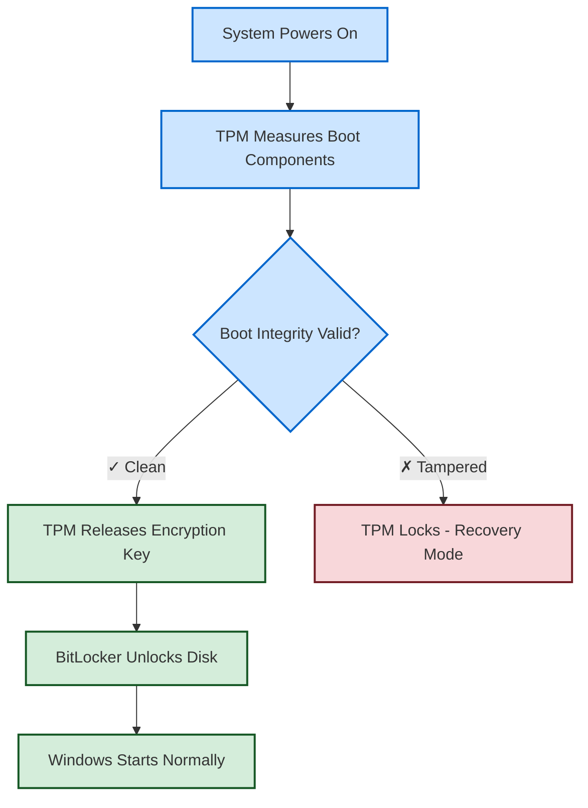

# The basics

The Trusted Platform Module (TPM) 2.0 has become one of cybersecurity's most polarizing technologies, generating fierce debate between hardware security advocates and skeptics who claim **"TPM gives you nothing you can't get without it."** With Microsoft initially mandating TPM 2.0 for Windows 11 and enterprise adoption accelerating, understanding the technical reality behind these claims has never been more critical. While TPM isn't a security panacea, the "useless TPM" narrative fundamentally misunderstands how hardware security works.

While Microsoft has recently allowed Windows 11 installation without TPM 2.0 (with warnings about compatibility and security), this relaxation represents a concerning step backward that undermines the security foundations the industry should be building upon.

## The technical reality behind TPM 2.0's capabilities

TPM 2.0 represents a substantial architectural leap over its predecessor, addressing the core limitations that made TPM 1.2 genuinely problematic for many use cases. Unlike TPM 1.2's rigid single-owner model with RSA-only cryptography, TPM 2.0 introduces a four-hierarchy authorization system supporting both RSA and elliptic curve cryptography with algorithm agility for future standards.

The hardware-level operation provides capabilities impossible to replicate in software. Discrete TPMs achieve FIPS-140 Level 3 physical security certification, featuring dedicated tamper-resistant microcontrollers that perform cryptographic operations without exposing keys to the main system. Platform Configuration Registers (PCRs) use one-way cryptographic extension operations where `PCR[N] = HASHalg(PCR[N] || ArgumentOfExtend)`, creating an unalterable chain of system measurements from boot through runtime.

Most critically, TPM 2.0's secure storage architecture provides hardware-isolated key protection that software solutions cannot match. While critics correctly note that TPM cryptographic operations are significantly slower than software implementations, this misses the fundamental point. TPM excels at key protection and attestation, not high-performance cryptography. In fact, cryptography and speed are often at odds—stronger security measures typically require additional computational overhead. The deliberate trade-off in TPM's design prioritizes more robust security over raw speed, ensuring that sensitive keys remain protected and inaccessible even if performance is sacrificed.

| Security Capability | Software-Only | TPM 2.0 | Technical Advantage |
|---------------------|---------------|---------|-------------------|
| Key Storage Security | Moderate | High | Hardware isolation prevents software-based extraction |
| Boot Integrity Verification | Not Possible | Strong | Hardware-anchored root of trust with PCR measurements |
| Remote Platform Attestation | Not Possible | Strong | Cryptographic proof of system state |
| Anti-tampering Protection | Minimal | High | Physical security mechanisms (discrete TPMs) |
| Dictionary Attack Resistance | Limited | Hardware-enforced | 32 failure lockout with 10-minute recovery intervals |

## Expert consensus: nuanced support with legitimate concerns

Security researchers and cryptographers present a more nuanced view than the binary pro/anti-TPM narratives suggest. Professor Ross Anderson from Cambridge University, who authored the influential "Trusted Computing FAQ" that initially undermined TPM adoption, focused his criticism on potential abuse for digital rights management rather than technical security capabilities.

Bruce Schneier, the renowned cryptographer, acknowledges this complexity:

> The same system that prevents worms and viruses from running on your computer might also stop you from using any legitimate software that your hardware or operating system vendor simply doesn't like.

*[Schneier on Security](https://www.schneier.com/tag/tpm/)*

Yet Schneier's technical analysis focuses on policy concerns and implementation vulnerabilities—not claims that TPM provides no security value.

Matthew Garrett, former Red Hat security developer and Linux kernel maintainer, provides perhaps the most balanced technical assessment:

> I think having a TPM enables a number of worthwhile security features. Given the choice, I'd certainly pick a computer with a TPM.

*Matthew Garrett - [Linux Security Developer](https://mjg59.dreamwidth.org/)*

However, he correctly notes that:

> stopping an attacker in possession of administrative privileges has never been one of the goals of TPM.

*Matthew Garrett - [Linux Security Developer](https://mjg59.dreamwidth.org/)*

Recent academic research reveals both TPM's value and vulnerabilities. The comprehensive 2024 "TPMScan" study by Petr Svenda's team at Masaryk University found serious cryptographic vulnerabilities in certified TPM implementations, including nonce leakages that allow private key extraction from certain Intel fTPMs using only nine signatures. Yet the same research validates TPM's core security model—the vulnerabilities exist in implementation flaws, not fundamental design problems.

## Real-world implementation data reveals practical security benefits

Performance analysis of major TPM implementations demonstrates minimal impact when properly deployed. BitLocker, Windows' full-disk encryption system, shows minimal impact on disk I/O performance because TPM only stores the Volume Master Key while the CPU handles all encryption operations using hardware acceleration. Boot time impact is minimal for key unsealing operations.

### How TPM Secures the Windows Boot Process

TPM creates a hardware-anchored chain of trust that addresses fundamental security gaps in traditional disk encryption:

**How This Fixes Real Attacks:**
- **Evil Maid Attacks**: Attacker modifies bootloader → TPM detects change → refuses to release keys
- **Firmware Tampering**: BIOS/UEFI modifications → measured by TPM → system enters recovery
- **Key Extraction**: Encryption keys sealed in tamper-resistant hardware, not accessible via software
- **Cold Boot Attacks**: Keys never stored in system RAM during boot process

Windows Credential Guard, which uses TPM as a hardware anchor for Virtualization-Based Security, effectively prevents pass-the-hash attacks when properly configured by isolating NTLM password hashes and Kerberos tickets in a hardware-protected hypervisor environment. The memory overhead is minimal at 100-200 KB for the VBS infrastructure.

Chrome OS's verified boot implementation demonstrates TPM's unique capabilities for preventing firmware rollback attacks. The system uses TPM primarily for secure non-volatile storage, not cryptographic operations, achieving comprehensive boot chain verification with minimal performance impact.

## Analyzing anti-TPM claims: separating legitimate concerns from misinformation

The most prominent "TPM is useless" arguments come from credentialed sources with legitimate but narrow concerns. Richard Stallman's "treacherous computing" critique focuses on potential DRM abuse, not technical security capabilities. The VeraCrypt developers argue that:

> if [an attacker] has administrator privileges or physical access to the computer... it is actually impossible to secure the computer... therefore, you must stop using it (instead of relying on TPM).

*[VeraCrypt Security Documentation](https://security.stackexchange.com/questions/151127/why-veracrypt-does-not-use-a-tpm)*

This argument is technically incomplete. While TPM cannot protect against all attack vectors with administrative access, it provides crucial security benefits for specific threat models:

**Hardware-based key storage** prevents key extraction through software attacks, even with administrative privileges. An attacker with admin access can delete encrypted data but cannot extract TPM-sealed keys to decrypt previously captured data or impersonate the system remotely.

**Boot integrity verification** detects unauthorized firmware modifications that occur between system shutdowns, protecting against "evil maid" attacks where attackers modify systems during physical access windows.

**Remote attestation capabilities** enable enterprise security systems to verify system integrity before granting network access, supporting Zero Trust architectures impossible to implement with software-only solutions.

## The vulnerability reality: implementation flaws vs. fundamental design

Critics correctly highlight real TPM vulnerabilities. The ROCA vulnerability (CVE-2017-15361) affected Infineon TPMs used in millions of devices. The TPM-FAIL research demonstrated timing attacks against signature generation in multiple TPM implementations. The Dolos Group showed physical bus interception attacks requiring specialized equipment but only 30 minutes of access.

However, these vulnerabilities demonstrate implementation flaws rather than fundamental design failures. Software-only security solutions face the same vulnerability challenges with additional attack surface. The 2024 TPMScan study found cryptographic implementation bugs in certified TPMs, but software cryptographic libraries have historically contained similar or worse vulnerabilities.

**Comparative vulnerability analysis** shows software-only solutions face greater systematic risks:
- 26,000+ software vulnerabilities published in 2023
- 75% of attacks exploit vulnerabilities from 2017 or earlier  
- 60% of breaches caused by failure to apply available software patches
- 98% of web applications vulnerable to attacks

TPM's hardware isolation fundamentally reduces attack surface compared to software-only implementations. While sophisticated attackers can compromise TPMs through targeted attacks, the same attackers can more easily compromise software-only security through established techniques.

## Performance optimization strategies for practical deployment

Understanding TPM's optimal use cases resolves the performance vs. security trade-off effectively. TPM excels when used for key protection and attestation rather than bulk cryptographic operations. BitLocker's architecture demonstrates this perfectly: TPM protects the Volume Master Key while CPU hardware acceleration handles disk encryption, achieving maximum security with minimal performance impact.

**Best practice implementation guidelines**:
1. Use TPM for secure key generation and storage, not high-volume cryptographic operations
2. Leverage CPU-based hardware acceleration for symmetric encryption workloads  
3. Implement session-based encryption for enhanced bus security (TPM 2.0)
4. Cache TPM-generated keys where security policies permit to reduce operational latency

Enterprise deployment strategies should prioritize TPM for certificate storage and authentication, where performance requirements are minimal but security benefits are substantial. For high-performance cryptographic workloads, the hybrid approach combining TPM key protection with CPU-accelerated operations provides optimal security and performance balance.

## Government and industry endorsement based on technical merit

The National Security Agency's 2024 guidance explicitly recommends TPM deployment:

> TPM is a vital component to mitigate vulnerabilities affecting user credentials, boot security, and static data.

*[NSA Cybersecurity Advisory](https://www.nsa.gov/Press-Room/Press-Releases-Statements/Press-Release-View/Article/3959033/nsa-issues-guidance-for-using-trusted-platform-modules-tpms/)*

NSA analyst Zachary Blum emphasizes that TPM enables previously undefined use cases for asset management, hardware supply chain verification, and system integrity monitoring.

NIST standards (SP 800-63B) recommend TPM for cryptographic key storage in federal systems. The Trusted Computing Group continues developing TPM standards with input from major technology companies, government agencies, and academic researchers—indicating sustained technical confidence rather than marketing-driven adoption.

International standardization through **ISO/IEC 11889:2015** provides additional validation of TPM's technical merit. Standards bodies typically require extensive technical review and demonstrated security benefits before approving hardware security specifications.

## The technical verdict: valuable but not universal

Our comprehensive analysis reveals that:

> "TPM gives you nothing you can't get without it" is technically false

for specific security capabilities:

- Hardware-isolated key storage cannot be replicated through software-only implementations
- Boot integrity verification requires hardware measurement capabilities  
- Remote platform attestation needs cryptographic proof of hardware state
- Dictionary attack protection benefits from hardware-enforced rate limiting

However, TPM is **not a comprehensive security solution**. It cannot prevent attacks with administrative privileges or sophisticated physical access. TPM works best as part of **defense-in-depth architectures** combining multiple security technologies.

The most credible criticisms—from experts like Stallman, Schneier, and Anderson—focus on **potential for abuse and implementation vulnerabilities** rather than fundamental security value. These are legitimate policy and engineering concerns distinct from claims that TPM provides no security benefit.

## Conclusion: separating technical merit from policy concerns

The TPM 2.0 debate reflects a fundamental confusion between **technical security capabilities and policy concerns**. Critics are correct that TPM enables potential abuse scenarios and contains implementation vulnerabilities. However, the technical evidence clearly demonstrates that TPM provides security capabilities impossible to achieve through software-only implementations.

Enterprise adoption rates, government endorsements, and academic research consistently support TPM's technical value when properly implemented. The technology excels at hardware-based key protection, boot integrity verification, and platform attestation—capabilities essential for modern enterprise security architectures.

Organizations should **adopt TPM for its proven security benefits** while acknowledging its limitations. TPM is not a silver bullet, but it provides fundamental hardware security capabilities that software-only solutions cannot match. The key to successful implementation is understanding TPM's optimal use cases and integrating it properly within comprehensive security strategies rather than expecting it to solve all security challenges independently.

The evidence suggests that "TPM gives you nothing you can't get without it" fundamentally misunderstands how hardware security works. While legitimate concerns about TPM abuse and vulnerabilities deserve attention, dismissing TPM's technical security value contradicts both academic research and real-world enterprise experience.