*Or: How I spent 3 days debugging why my node graph thought I was clicking 250 pixels to the left of where my mouse actually was.*

## The Scene of the Crime

Picture this: You're building a beautiful node graph editor in GPUI (the UI framework powering [Zed](https://zed.dev/)). You've got nodes, connections, dragging, selection boxes—the works. Everything looks perfect. You click a node to select it and... you select empty space. You try to drag a node and grab thin air instead. Your selection box appears 250 pixels away from your cursor.

What's happening? Welcome to the world of coordinate systems, my friend.

```
Your cursor:           Node you wanted to select:
       ↓                     ↓
   [ Canvas Area       [NODE]           ]
                       ↑
              Where the click actually registered
```

This is the story of how we fixed this, and more importantly, **why** it was broken in the first place.

## GPUI Crash Course: The 5-Minute Version

Before we dive into coordinates, let's talk about GPUI itself. If you're coming from React or any web framework, GPUI will feel both familiar and alien.

### What is GPUI?

GPUI is a GPU-accelerated, immediate-mode UI framework written in Rust. It's what powers Zed, and it's designed for **performance**. We're talking buttery-smooth 120fps rendering with complex UI layouts.

Key concepts:

**1. Elements are declarative (like React)**

```rust
div()
    .flex()
    .gap_4()
    .child("Hello")
    .child("World")
```

**2. Everything is strongly typed (it's Rust, baby)**

```rust
fn render(&mut self, cx: &mut Context<Self>) -> impl IntoElement {
    div().child("My UI")
}
```

**3. State lives in "Views" (like React components)**

```rust
pub struct MyView {
    count: usize,
    name: String,
}

impl Render for MyView {
    fn render(&mut self, cx: &mut Context<Self>) -> impl IntoElement {
        div().child(format!("Count: {}", self.count))
    }
}
```

**4. Events are handled with listeners**

```rust
div()
    .on_mouse_down(gpui::MouseButton::Left, cx.listener(|view, event, window, cx| {
        println!("Clicked at: {:?}", event.position);
    }))
```

### The Element Tree

GPUI builds an element tree similar to the DOM:

```
Window (root)
  └─ Application
      ├─ Toolbar (y: 0)
      ├─ LeftSidebar (x: 0, y: 30, width: 250)
      └─ MainPanel (x: 250, y: 30)
          └─ NodeGraph ← You are here
              ├─ Node1
              ├─ Node2
              └─ Connection
```

Each element has a position **relative to the window origin** (top-left corner = `(0, 0)`).

## The Problem: When Coordinates Attack

Now here's where it gets spicy. GPUI gives you mouse events with positions like this:

```rust
MouseDownEvent {
    position: Point { x: 417px, y: 145px },  // ← Relative to WINDOW
    button: Left,
}
```

But your node graph needs to know: "Did they click Node1? Node2? Empty space?"

To answer that, you need the mouse position **relative to your graph element**, not the window.

### The First (Terrible) Solution

When we first built this, we did what every developer does when they're in a hurry:

```rust
const Y_OFFSET: f32 = 135.0;
const X_OFFSET: f32 = 8.0;

pub fn window_to_graph_pos(window_pos: Point<Pixels>) -> Point<Pixels> {
    Point::new(
        window_pos.x - px(X_OFFSET),
        window_pos.y - px(Y_OFFSET),
    )
}
```

**Magic numbers.** We measured the offset with a ruler (okay, not literally, but we eyeballed it in the inspector) and hardcoded it.

This worked! For exactly 47 seconds. Until we:
- Resized a sidebar
- Added a toolbar button
- Adjusted padding
- Breathed near the layout code

Then everything was off again. Clicks registered in the wrong place. Dragging was broken. The node creation menu appeared in random locations.

```
User: *clicks node*
Graph: "You clicked 250px to the left of nothing, here's a context menu!"
User: "I hate computers"
```

## The Rabbit Hole: Understanding GPUI Coordinates

Time to understand what's actually happening. GPUI has multiple coordinate spaces:

### 1. Window Coordinates

The entire application window. Origin at top-left.

```
(0,0) ─────────────────────────┐
│ Toolbar                      │
├──────────────────────────────┤
│ Side │ Main Panel            │
│ bar  │                       │
│      │   Your mouse is here: │
│      │   (417, 145)          │
└──────────────────────────────┘
```

### 2. Element Coordinates

Relative to a specific element's top-left corner.

```
Node Graph Element
(0,0) ─────────────────────────┐
│                              │
│   Your mouse in              │
│   element coords:            │
│   (167, 72)                  │
│                              │
└──────────────────────────────┘
```

### 3. Graph/Canvas Coordinates

Your custom coordinate system (with pan/zoom).

```
Graph space (with pan/zoom)
(-100,-50) ───────────────────┐
│                             │
│  [Node1]      [Node2]       │
│                             │
│       Your mouse in         │
│       graph coords:         │
│       (67, 22)              │
│            (zoom: 1.0)      │
└─────────────────────────────┘
```

### The Conversion Chain

```
Window Coords → Element Coords → Graph Coords
   (417, 145) →    (167, 72)   →   (67, 22)
```

## The Journey to a Solution

### Attempt 1: `window.element_offset()`

Our first "smart" attempt used GPUI's `element_offset()` method:

```rust
.on_children_prepainted(move |children_bounds, window, cx| {
    let offset = window.element_offset();
    // Spoiler: This didn't work
})
```

**Result:** We got `(0px, 73px)` as the offset.

"Wait," we thought, "there's a 250px sidebar. The X offset should be 250px!"

### The Revelation: Paint Context vs Window

Here's the gotcha: **`window.element_offset()` gives you the offset relative to the current paint context, not the window root.**

During prepaint, GPUI maintains a stack of transformations. When you call `element_offset()`, you get your position relative to your parent's coordinate system, which might already be offset from the window.

```
Window (0,0)
  └─ Sidebar (0, 30)
      └─ Panel (250, 0)  ← paint context origin
          └─ Graph (0, 73)  ← element_offset() says (0, 73)
                            ← but actual window offset is (250, 103)!
```

### Attempt 2: Inspector to the Rescue

We noticed the GPUI inspector shows element bounds perfectly:

```
Layout:
  Bounds: (250px, 103px) - (982px, 723px)
  Size: 732px × 620px
```

How does it do it? We dove into the GPUI source code and found `DivInspectorState`:

```rust
pub struct DivInspectorState {
    pub bounds: Bounds<Pixels>,  // ← In window coordinates!
    pub content_size: Size<Pixels>,
}
```

The inspector gets these bounds during prepaint. But how?

### The Breakthrough: Children Bounds

Reading more GPUI source, we found the answer in the `on_children_prepainted` callback:

```rust
fn on_children_prepainted(
    self,
    listener: impl Fn(Vec<Bounds<Pixels>>, &mut Window, &mut App) + 'static,
) -> Self
```

That `Vec<Bounds<Pixels>>` parameter—**those bounds are in window coordinates!**

```rust
.on_children_prepainted(move |children_bounds, _window, cx| {
    for child_bounds in &children_bounds {
        println!("Child at: {:?}", child_bounds.origin);
        // Prints actual window coordinates!
    }
})
```

### The Solution

If children bounds are in window coordinates, we can compute our element's window bounds by finding the bounding box of all children:

```rust
.on_children_prepainted({
    let panel_entity = cx.entity().clone();
    move |children_bounds, _window, cx| {
        if !children_bounds.is_empty() {
            // Find bounding box of all children
            let mut min_x = f32::MAX;
            let mut min_y = f32::MAX;
            let mut max_x = f32::MIN;
            let mut max_y = f32::MIN;

            for child_bounds in &children_bounds {
                min_x = min_x.min(child_bounds.origin.x.0);
                min_y = min_y.min(child_bounds.origin.y.0);
                max_x = max_x.max((child_bounds.origin.x + child_bounds.size.width).0);
                max_y = max_y.max((child_bounds.origin.y + child_bounds.size.height).0);
            }

            // This is our element's window-relative bounds!
            let origin = Point { x: px(min_x), y: px(min_y) };
            let size = Size {
                width: px(max_x - min_x),
                height: px(max_y - min_y),
            };

            panel_entity.update(cx, |panel, _cx| {
                panel.graph_element_bounds = Some(Bounds { origin, size });
            });
        }
    }
})
```

## The Implementation: Real Working Code

Here's the actual code from our node graph editor (fully working, battle-tested):

### Step 1: Add Bounds Storage

```rust
pub struct BlueprintEditorPanel {
    focus_handle: FocusHandle,
    pub graph: BlueprintGraph,

    // Store the graph element's window-relative bounds
    pub graph_element_bounds: Option<gpui::Bounds<gpui::Pixels>>,

    // ... other fields
}
```

### Step 2: Capture Bounds During Render

```rust
impl Render for BlueprintEditorPanel {
    fn render(&mut self, cx: &mut Context<Self>) -> impl IntoElement {
        let panel_entity = cx.entity().clone();
        let focus_handle = self.focus_handle.clone();

        div()
            .size_full()
            .relative()
            .bg(cx.theme().muted.opacity(0.1))
            .border_1()
            .border_color(cx.theme().border)
            .overflow_hidden()
            .track_focus(&focus_handle)
            .key_context("BlueprintGraph")
            // The magic happens here! ✨
            .on_children_prepainted({
                let panel_entity = panel_entity.clone();
                move |children_bounds, _window, cx| {
                    if !children_bounds.is_empty() {
                        // Calculate bounding box from children
                        let mut min_x = f32::MAX;
                        let mut min_y = f32::MAX;
                        let mut max_x = f32::MIN;
                        let mut max_y = f32::MIN;

                        for child_bounds in &children_bounds {
                            min_x = min_x.min(child_bounds.origin.x.0);
                            min_y = min_y.min(child_bounds.origin.y.0);
                            max_x = max_x.max((child_bounds.origin.x + child_bounds.size.width).0);
                            max_y = max_y.max((child_bounds.origin.y + child_bounds.size.height).0);
                        }

                        let origin = gpui::Point { x: px(min_x), y: px(min_y) };
                        let size = gpui::Size {
                            width: px(max_x - min_x),
                            height: px(max_y - min_y),
                        };

                        // Store for use in event handlers
                        panel_entity.update(cx, |panel, _cx| {
                            panel.graph_element_bounds = Some(gpui::Bounds { origin, size });
                        });
                    }
                }
            })
            .id("blueprint-graph")
            .on_mouse_down(gpui::MouseButton::Left, cx.listener(|panel, event, window, cx| {
                panel.focus_handle().focus(window);
            }))
            .child(self.render_nodes(cx))
            .child(self.render_connections(cx))
    }
}
```

### Step 3: Convert Coordinates

```rust
/// Convert window-relative coordinates to graph element coordinates
pub fn window_to_graph_element_pos(
    window_pos: Point<Pixels>,
    panel: &BlueprintEditorPanel
) -> Point<Pixels> {
    if let Some(bounds) = &panel.graph_element_bounds {
        // Simple subtraction!
        Point::new(
            window_pos.x - bounds.origin.x,
            window_pos.y - bounds.origin.y,
        )
    } else {
        // Before first frame, bounds aren't captured yet
        window_pos
    }
}
```

### Step 4: Use in Event Handlers

```rust
.on_mouse_down(
    gpui::MouseButton::Left,
    cx.listener(|panel, event: &MouseDownEvent, _window, cx| {
        // Convert to element coordinates
        let element_pos = Self::window_to_graph_element_pos(event.position, panel);

        // Now convert to graph space (accounting for pan/zoom)
        let graph_pos = Point::new(
            (element_pos.x.0 / panel.graph.zoom_level) - panel.graph.pan_offset.x,
            (element_pos.y.0 / panel.graph.zoom_level) - panel.graph.pan_offset.y,
        );

        // Check if we clicked a node
        for node in &panel.graph.nodes {
            let node_bounds = Rect {
                x: node.position.x,
                y: node.position.y,
                width: node.size.width,
                height: node.size.height,
            };

            if node_bounds.contains(graph_pos) {
                println!("Clicked node: {}", node.title);
                panel.select_node(node.id.clone(), cx);
                return;
            }
        }

        println!("Clicked empty space");
        panel.clear_selection(cx);
    })
)
```

## The Math: Why This Works

Let's break down the coordinate conversion:

```
Window coordinates:     (417px, 145px)
Element origin:         (250px, 73px)
Element coordinates:    (417 - 250, 145 - 73) = (167px, 72px)
```

Both values are relative to window origin, so subtraction gives us the position relative to the element.

### Visual Proof

```
Window space:
(0,0) ────────────────────────────┐
│ ┌──────┐                        │
│ │Side- │  Element origin        │
│ │bar   │  (250, 73)             │
│ │250px │  ┌──────────────────┐  │
│ └──────┘  │                  │  │
│           │  Mouse at        │  │
│           │  (167, 72)       │  │
│           │  in element      │  │
│           │  coordinates     │  │
│           │                  │  │
│           │  (417, 145)      │  │
│           │  in window       │  │
│           │  coordinates     │  │
│           └──────────────────┘  │
└─────────────────────────────────┘
```

## Advanced: Handling Pan and Zoom

Once you have element coordinates, you often need to convert to your custom graph space:

```rust
pub fn element_to_graph_pos(
    element_pos: Point<Pixels>,
    graph: &BlueprintGraph,
) -> Point<f32> {
    Point::new(
        (element_pos.x.0 / graph.zoom_level) - graph.pan_offset.x,
        (element_pos.y.0 / graph.zoom_level) - graph.pan_offset.y,
    )
}

pub fn graph_to_element_pos(
    graph_pos: Point<f32>,
    graph: &BlueprintGraph,
) -> Point<Pixels> {
    Point::new(
        px((graph_pos.x + graph.pan_offset.x) * graph.zoom_level),
        px((graph_pos.y + graph.pan_offset.y) * graph.zoom_level),
    )
}
```

Example: Zooming around the mouse cursor

```rust
.on_scroll_wheel(cx.listener(|panel, event: &ScrollWheelEvent, _window, cx| {
    let delta_y = match event.delta {
        ScrollDelta::Pixels(p) => p.y.0,
        ScrollDelta::Lines(l) => l.y * 20.0,
    };

    // Get mouse position in element coordinates
    let element_pos = Self::window_to_graph_element_pos(event.position, panel);

    // Convert to graph coordinates before zoom
    let graph_pos_before = Self::element_to_graph_pos(element_pos, &panel.graph);

    // Apply zoom
    let zoom_factor = if delta_y < 0.0 { 1.1 } else { 0.9 };
    panel.graph.zoom_level *= zoom_factor;
    panel.graph.zoom_level = panel.graph.zoom_level.clamp(0.1, 5.0);

    // Convert back to graph coordinates after zoom
    let graph_pos_after = Self::element_to_graph_pos(element_pos, &panel.graph);

    // Adjust pan to keep mouse position stable
    panel.graph.pan_offset.x += graph_pos_before.x - graph_pos_after.x;
    panel.graph.pan_offset.y += graph_pos_before.y - graph_pos_after.y;

    cx.notify();
}))
```

## Debugging: Trust But Verify

Add debug output to verify your coordinates:

```rust
.on_mouse_down(gpui::MouseButton::Left, cx.listener(|panel, event, _window, cx| {
    println!("─────────────────────────────────");
    println!("Window pos: ({}, {})", event.position.x, event.position.y);

    if let Some(bounds) = &panel.graph_element_bounds {
        println!("Element origin: ({}, {})", bounds.origin.x, bounds.origin.y);
        println!("Element size: {} × {}", bounds.size.width, bounds.size.height);
    }

    let element_pos = Self::window_to_graph_element_pos(event.position, panel);
    println!("Element pos: ({}, {})", element_pos.x, element_pos.y);

    let graph_pos = Self::element_to_graph_pos(element_pos, &panel.graph);
    println!("Graph pos: ({}, {})", graph_pos.x, graph_pos.y);
    println!("Pan offset: ({}, {})", panel.graph.pan_offset.x, panel.graph.pan_offset.y);
    println!("Zoom: {}", panel.graph.zoom_level);
}))
```

Example output:
```
─────────────────────────────────
Window pos: (417px, 145px)
Element origin: (250px, 73px)
Element size: 732px × 620px
Element pos: (167px, 72px)
Graph pos: (167, 72)
Pan offset: (0, 0)
Zoom: 1
```

Click at the top-left corner of your element—you should see element pos close to `(0, 0)`.

## Common Gotchas

### ❌ Gotcha 1: Using `element_offset()` Wrong

```rust
// WRONG - gives offset from paint context, not window!
.on_children_prepainted(move |children_bounds, window, cx| {
    let offset = window.element_offset(); // ⚠️
})
```

### ❌ Gotcha 2: Forgetting to Store Bounds

```rust
// WRONG - calculated but never stored!
.on_children_prepainted(move |children_bounds, window, cx| {
    let bounds = calculate_bounds(children_bounds);
    // Forgot to: panel.graph_element_bounds = Some(bounds);
})
```

### ❌ Gotcha 3: Wrong Event for Updates

```rust
// WRONG - on_mouse_down fires too late, bounds already stale
.on_mouse_down(cx.listener(|panel, event, window, cx| {
    let offset = window.element_offset(); // Too late!
})
```

### ✅ Correct Approach

```rust
// RIGHT - capture during prepaint, use in events
.on_children_prepainted({
    let entity = cx.entity().clone();
    move |bounds, _w, cx| {
        entity.update(cx, |panel, _| {
            panel.element_bounds = calculate_bounds(bounds);
        });
    }
})
.on_mouse_down(cx.listener(|panel, event, _w, cx| {
    let pos = convert_coords(event.position, &panel.element_bounds);
    // Use pre-captured bounds ✓
}))
```

## Real-World Performance

You might wonder: "Isn't calculating bounding boxes every frame expensive?"

**Nope!** Here's why:

1. **Prepaint runs once per frame** (~16ms @ 60fps, 8ms @ 120fps)
2. **Bounding box is O(n)** where n = number of children (usually < 100)
3. **Simple floating point math** - nanoseconds per child

In our node graph with 50+ nodes, the overhead is **< 0.01ms per frame**. Completely negligible.

```
Profiling results:
├─ Frame total: 12.5ms
├─ Layout: 0.8ms
├─ Prepaint: 0.3ms
│  └─ Bounds calculation: 0.008ms  ← Here!
├─ Paint: 11.2ms
└─ Swap: 0.2ms
```

## Beyond Node Graphs: Other Use Cases

This technique works for any interactive custom coordinate system:

### Image Editor

```rust
struct ImageEditor {
    element_bounds: Option<Bounds<Pixels>>,
    canvas_offset: Point<f32>,
    zoom: f32,
}

// Click on image → get pixel coordinates
let pixel_pos = window_to_canvas_pos(event.position, editor);
editor.paint_pixel(pixel_pos, Color::RED);
```

### Game Viewport

```rust
struct GameViewport {
    element_bounds: Option<Bounds<Pixels>>,
    camera_pos: Point<f32>,
}

// Click in viewport → spawn entity at world position
let world_pos = window_to_world_pos(event.position, viewport);
game.spawn_entity(world_pos);
```

### Timeline Editor

```rust
struct Timeline {
    element_bounds: Option<Bounds<Pixels>>,
    time_scale: f32,    // pixels per second
    scroll_offset: f32,
}

// Click on timeline → get timestamp
let timestamp = window_to_time(event.position, timeline);
timeline.seek_to(timestamp);
```

## The Complete Picture: GPUI Element Lifecycle

```mermaid
flowchart TD
    A[1. Render<br/>Your code creates element tree<br/>Bounds: ❌ Not available]
    B[2. Layout<br/>GPUI calculates sizes and positions<br/>Bounds: ⚠️ Calculated but private]
    C[3. Prepaint<br/>on_children_prepainted fires<br/>Bounds: ✅ Available in callback!]
    D[4. Paint<br/>Elements drawn to GPU<br/>Bounds: ✅ Stored in your state]
    E[5. Events<br/>User clicks, mouse moves, etc.<br/>Bounds: ✅ Use stored bounds!]

    A --> B
    B --> C
    C --> D
    D --> E
```



## Tips for GPUI Beginners

### 1. Use the Inspector

Press `Cmd+Option+I` (Mac) or `Ctrl+Alt+I` (Windows/Linux) to open the GPUI inspector. It shows:
- Element tree
- Bounds (in window coordinates!)
- Styles
- Hit testing

This is invaluable for debugging coordinate issues.

### 2. Add IDs to Your Elements

```rust
div()
    .id("my-element")  // Shows in inspector
    .child("Content")
```

### 3. Use Semantic Naming

```rust
// Good - self-documenting
let window_pos = event.position;
let element_pos = window_to_element(window_pos);
let graph_pos = element_to_graph(element_pos);

// Bad - what coordinate space is this?
let pos1 = event.position;
let pos2 = convert(pos1);
let pos3 = transform(pos2);
```

### 4. Draw Debug Overlays

```rust
fn render_debug_overlay(&self) -> impl IntoElement {
    if !self.debug_mode {
        return div();  // Empty
    }

    div()
        .absolute()
        .inset_0()
        .child(
            div()
                .absolute()
                .left(px(0.0))
                .top(px(0.0))
                .size(px(10.0))
                .bg(rgb(0xFF0000))  // Red dot at origin
        )
        .child(
            div()
                .absolute()
                .left(px(self.mouse_pos.x))
                .top(px(self.mouse_pos.y))
                .size(px(5.0))
                .bg(rgb(0x00FF00))  // Green dot at mouse
        )
}
```

## Lessons Learned

1. **Never hardcode layout values** - Let the layout engine tell you where things are
2. **Children bounds are in window coordinates** - This is the key insight
3. **Capture during prepaint, use in events** - Separation of concerns
4. **Trust but verify** - Add debug output until you're confident
5. **Read the source** - GPUI's code is readable and well-structured

## Conclusion: From Mystery to Mastery

What started as "why is my mouse 250 pixels off?" turned into a deep dive into GPUI's coordinate systems. The solution is elegant:

1. **Capture element bounds** using `on_children_prepainted` and the children's bounding box
2. **Store bounds** in your view state
3. **Convert coordinates** with simple subtraction

No magic numbers. No hardcoded offsets. No brittleness.

Just clean, robust code that adapts automatically to any layout changes.

## Resources

- **GPUI Repository**: https://github.com/zed-industries/zed/tree/main/crates/gpui
- **This Article's Example Code**: [Pulsar Native Blueprint Editor](https://github.com/Far-Beyond-Pulsar/Pulsar-Native)

---

## Appendix: The Full Coordinate Conversion Module

Here's the complete, production-ready code:

```rust
use gpui::{Point, Pixels, px, Bounds, Size};

/// Coordinate conversion utilities for interactive canvases in GPUI
pub struct CoordConverter;

impl CoordConverter {
    /// Convert window coordinates to element coordinates
    ///
    /// # Arguments
    /// * `window_pos` - Mouse position from GPUI event (window-relative)
    /// * `element_bounds` - Element bounds captured during prepaint
    ///
    /// # Returns
    /// Position relative to element's top-left corner
    pub fn window_to_element(
        window_pos: Point<Pixels>,
        element_bounds: Option<&Bounds<Pixels>>,
    ) -> Point<Pixels> {
        if let Some(bounds) = element_bounds {
            Point::new(
                window_pos.x - bounds.origin.x,
                window_pos.y - bounds.origin.y,
            )
        } else {
            // Fallback before first frame
            window_pos
        }
    }

    /// Convert element coordinates to graph/canvas coordinates
    ///
    /// # Arguments
    /// * `element_pos` - Position relative to element
    /// * `pan_offset` - Pan offset in graph units
    /// * `zoom` - Zoom level (1.0 = 100%)
    pub fn element_to_graph(
        element_pos: Point<Pixels>,
        pan_offset: Point<f32>,
        zoom: f32,
    ) -> Point<f32> {
        Point::new(
            (element_pos.x.0 / zoom) - pan_offset.x,
            (element_pos.y.0 / zoom) - pan_offset.y,
        )
    }

    /// Convert graph coordinates to element coordinates
    pub fn graph_to_element(
        graph_pos: Point<f32>,
        pan_offset: Point<f32>,
        zoom: f32,
    ) -> Point<Pixels> {
        Point::new(
            px((graph_pos.x + pan_offset.x) * zoom),
            px((graph_pos.y + pan_offset.y) * zoom),
        )
    }

    /// One-shot conversion: window → element → graph
    pub fn window_to_graph(
        window_pos: Point<Pixels>,
        element_bounds: Option<&Bounds<Pixels>>,
        pan_offset: Point<f32>,
        zoom: f32,
    ) -> Point<f32> {
        let element_pos = Self::window_to_element(window_pos, element_bounds);
        Self::element_to_graph(element_pos, pan_offset, zoom)
    }

    /// Calculate bounding box from children bounds (all in window coords)
    pub fn bounds_from_children(
        children_bounds: &[Bounds<Pixels>],
    ) -> Option<Bounds<Pixels>> {
        if children_bounds.is_empty() {
            return None;
        }

        let mut min_x = f32::MAX;
        let mut min_y = f32::MAX;
        let mut max_x = f32::MIN;
        let mut max_y = f32::MIN;

        for bounds in children_bounds {
            min_x = min_x.min(bounds.origin.x.0);
            min_y = min_y.min(bounds.origin.y.0);
            max_x = max_x.max((bounds.origin.x + bounds.size.width).0);
            max_y = max_y.max((bounds.origin.y + bounds.size.height).0);
        }

        Some(Bounds {
            origin: Point { x: px(min_x), y: px(min_y) },
            size: Size {
                width: px(max_x - min_x),
                height: px(max_y - min_y),
            },
        })
    }
}
```

Use it like this:

```rust
.on_children_prepainted({
    let entity = cx.entity().clone();
    move |children_bounds, _window, cx| {
        if let Some(bounds) = CoordConverter::bounds_from_children(&children_bounds) {
            entity.update(cx, |view, _| {
                view.element_bounds = Some(bounds);
            });
        }
    }
})
.on_mouse_down(cx.listener(|view, event, _window, cx| {
    let graph_pos = CoordConverter::window_to_graph(
        event.position,
        view.element_bounds.as_ref(),
        view.pan_offset,
        view.zoom,
    );
    // Use graph_pos...
}))
```

Now go build something awesome! 🚀
