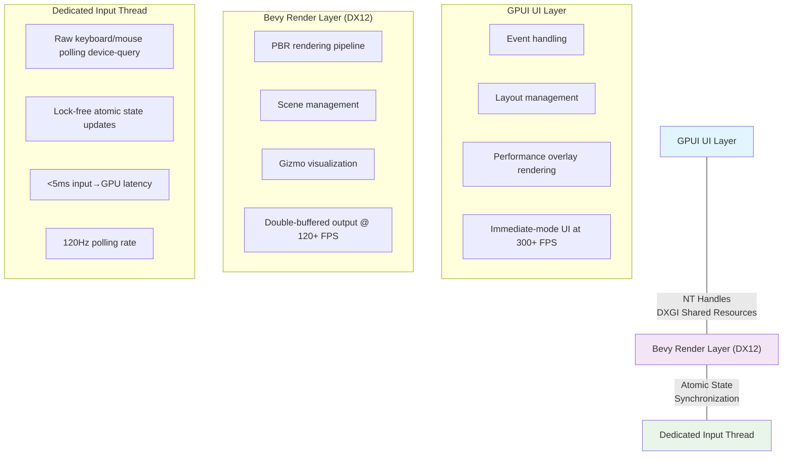

## Introduction

For the past several months, I've been deep in the trenches building a professional-grade 3D viewport system for the Pulsar game engine. The goal was ambitious: create a viewport that could rival commercial tools like Unreal Engine or Unity Editor while leveraging Rust's safety guarantees and the emerging ecosystem of modern UI frameworks. What emerged from this work is a system that achieves true zero-copy GPU rendering by bridging two very different technologies: Bevy's DirectX 12 renderer and GPUI's DirectX 11 immediate-mode UI framework.

The central technical challenge was eliminating the traditional bottleneck that plagues most 3D editor implementations. When you render a 3D scene in one context and display it in a UI framework, the conventional approach involves copying pixel data from GPU memory to CPU memory, then back to GPU memory for display. For a typical 1600×900 viewport with 32-bit BGRA pixels, that's 5.76 MB of data crossing the PCIe bus twice per frame. Even on modern hardware with PCIe 3.0 speeds of around 16 GB/s, driver overhead can push each copy operation into the 10-20ms range. This effectively caps your viewport at around 50 FPS with noticeable stuttering.

The solution I developed eliminates these copies entirely using DXGI shared resources, a Windows mechanism that allows different DirectX contexts to access the same GPU memory simultaneously. Combined with a dedicated input thread using lock-free atomics and careful double-buffering, the result is a viewport that delivers sub-5ms input latency and can refresh at over 300 FPS in the UI layer while the 3D renderer runs independently at 120+ FPS.

## Table of Contents

1. [Architecture Overview](#architecture-overview)
2. [The Zero-Copy Challenge](#the-zero-copy-challenge)
3. [DXGI Shared Resources: The Foundation](#dxgi-shared-resources-the-foundation)
4. [Lock-Free Input Processing](#lock-free-input-processing)
5. [Double Buffering with Atomics](#double-buffering-with-atomics)
6. [Implementation Details](#implementation-details)
7. [Performance Characteristics](#performance-characteristics)
8. [Lessons Learned](#lessons-learned)

---

## Architecture Overview

The viewport system operates across three distinct layers, each running in its own thread with minimal coupling between them. This separation allows each layer to optimize for its specific workload without being bottlenecked by the others.



### Design Principles

The architecture is built on five core principles that emerged from iterating on earlier, less successful designs:

**Zero-Copy Philosophy**: If data starts on the GPU and ends on the GPU, it should never visit the CPU. This principle guided the decision to use DXGI shared resources rather than traditional framebuffer readback approaches.

**Lock-Free Communication**: Mutexes introduce unpredictable latency and the risk of priority inversion. By using atomic operations for all inter-thread communication, we ensure that threads never block waiting for each other and maintain consistent timing.

**Dedicated Threads**: Rather than multiplexing tasks on shared thread pools, each major subsystem gets its own thread with a clear responsibility. The input thread polls hardware, the render thread manages 3D scene rendering, and the UI thread handles layout and display.

**Double Buffering**: Read from one buffer while writing to another. This classic technique prevents tearing without requiring explicit synchronization barriers that would couple the threads together.

**Immediate Mode**: GPUI's immediate-mode architecture means it can display GPU textures directly in the same frame without requiring staging buffers or additional copies.

---

## The Zero-Copy Challenge

Before diving into solutions, it's worth understanding why this problem is so pervasive in 3D editors and game engine tools. The issue stems from an architectural mismatch between rendering systems and UI frameworks.

### The Traditional Approach (and Why It Fails)

Most 3D editors separate their rendering pipeline from their UI layer for good architectural reasons. The renderer focuses on scene management, lighting calculations, and GPU optimization. The UI framework handles layout, event processing, and responsive interface elements. These are fundamentally different concerns that benefit from separation.

The trouble starts when these systems need to communicate. Here's what the traditional approach looks like:

```rust
// Traditional approach (BAD - 3+ copies!)
fn render_traditional() {
    // Copy 1: Render to GPU texture
    bevy_renderer.render_to_texture(gpu_texture);
    
    // Copy 2: GPU → CPU (expensive!)
    let pixels = gpu_texture.read_to_cpu(); // ~10ms for 1600x900
    
    // Copy 3: CPU → UI framework texture
    ui_framework.update_texture(pixels); // ~5ms
    
    // Total: ~15-20ms of pure memory copying!
    // Result: Stuttery 50 FPS viewport
}
```

For a 1600×900 BGRA texture, each copy moves 5.76 MB of data:
- 1600 × 900 × 4 bytes = 5,760,000 bytes
- At PCIe 3.0 speeds (~16 GB/s), the minimum theoretical time is ~0.36ms
- In practice, driver overhead makes it 10-20ms

This isn't just slow—it's fundamentally wasteful. The pixel data starts on the GPU, travels to the CPU where it serves no computational purpose, then travels right back to the GPU. It's like having two refrigerators in your kitchen and moving milk from one to the other every time you want a glass.

The problem becomes especially acute when you consider that professional-grade 3D editors need to feel responsive. Artists and designers develop muscle memory around viewport navigation. When there's noticeable lag between moving the mouse and seeing the camera rotate, it breaks the creative flow. Industry research on input latency has shown that even delays as small as 16-33ms can be perceptible to experienced users and affect precision tasks (see [inputlag.science](https://inputlag.science/engine) for detailed analysis of game engine latency).

---

## DXGI Shared Resources: The Foundation

The Windows graphics infrastructure provides a powerful but under-documented feature called DXGI shared resources. Understanding how this works requires a brief dive into the Windows graphics stack.

### Understanding DXGI

DXGI (DirectX Graphics Infrastructure) is the abstraction layer that sits between DirectX APIs and the actual GPU hardware. According to [Microsoft's documentation](https://learn.microsoft.com/en-us/windows/win32/direct3ddxgi/dx-graphics-dxgi), DXGI handles "enumerating graphics adapters and monitors, enumerating display modes, selecting buffer formats, sharing resources between processes, and presenting rendered frames to a window or monitor."

The shared resource mechanism allows textures created in one DirectX context to be opened and accessed in another context, even across different API versions. This capability was originally designed for scenarios like sharing rendered frames with the Desktop Window Manager (DWM) or allowing multiple processes to collaborate on graphics output. However, it works equally well for bridging different DirectX versions within the same process—exactly what we need to connect Bevy's DX12 renderer with GPUI's DX11 UI framework.

### How Shared Resources Actually Work

The magic happens through NT handles (Windows kernel object handles). When you create a texture in DirectX 12 with the appropriate sharing flags, the system can generate an NT handle that represents that GPU memory. Another DirectX context—even one using DirectX 11—can then open that same GPU memory using the NT handle. Both contexts now reference the same physical VRAM, with no copying required.

Here's our zero-copy approach in action:

```rust
// Our approach (GOOD - ZERO copies!)
fn render_zero_copy() {
    // Bevy (DX12) renders to shared texture
    bevy_renderer.render_to_shared_texture(); // < 8ms GPU time
    
    // Swap buffer indices (atomic operation)
    swap_buffers(); // < 0.001ms
    
    // GPUI (DX11) opens the same texture via NT handle
    gpui.display_shared_texture(nt_handle); // < 0.1ms
    
    // Total copy time: 0ms (GPU memory stays on GPU!)
    // Result: Smooth 300+ FPS UI, 120+ FPS rendering
}
```

The key insight: Both DirectX 11 and DirectX 12 can access the same GPU memory simultaneously through NT handles. The GPU memory never leaves the GPU.

### Implementation: Creating Shared Textures

The implementation happens in the Bevy render layer. Here's the actual code that creates our shared textures:

```rust
// Located in: crates/engine_backend/src/subsystems/render/bevy_renderer/textures.rs

/// Create 2 DXGI shared textures (render targets)
pub fn create_shared_textures(
    shared_textures: Res<SharedTexturesResource>,
    mut gpu_images: ResMut<RenderAssets<GpuImage>>,
    render_device: Res<RenderDevice>,
) {
    // Get DX12 device from Bevy's wgpu
    let d3d12_device = render_device.wgpu_device()
        .as_hal::<Dx12>()
        .unwrap()
        .raw_device()
        .clone();
    
    // Create shared texture with proper flags
    let tex_0 = unsafe {
        DxgiSharedTexture::create(
            &d3d12_device,
            RENDER_WIDTH,
            RENDER_HEIGHT,
            DXGI_FORMAT_B8G8R8A8_UNORM
        ).unwrap()
    };
    
    let tex_1 = unsafe {
        DxgiSharedTexture::create(
            &d3d12_device,
            RENDER_WIDTH,
            RENDER_HEIGHT,
            DXGI_FORMAT_B8G8R8A8_UNORM
        ).unwrap()
    };
    
    // Extract NT handles (these are kernel object handles)
    let handle_0 = tex_0.handle_value(); // e.g., 0x1A2B3C4D
    let handle_1 = tex_1.handle_value();
    
    // Store globally for GPUI access
    store_shared_handles(vec![handle_0, handle_1]);
    
    // Wrap as wgpu textures and inject into Bevy
    let wgpu_tex_0 = render_device.wgpu_device()
        .create_texture_from_hal::<Dx12>(hal_tex_0, &desc);
    
    // CRITICAL: Inject into Bevy's asset system
    gpu_images.insert(&texture_handles[0], gpu_img_0);
    
    // Keep textures alive (std::mem::forget prevents Drop)
    std::mem::forget(tex_0);
    std::mem::forget(tex_1);
}
```

The `std::mem::forget` at the end is crucial. We're transferring ownership of these textures to the GPU/DirectX system. If Rust's Drop implementation ran, it would destroy the textures while they're still in use. By forgetting them, we ensure they remain alive for the entire program lifetime.

### Opening Shared Resources in DirectX 11

On the GPUI side, we need to open these shared resources. This is handled by our DX11 bridge layer:

```rust
// Located in: crates/ui/src/dx11_shared_opener.rs

pub unsafe fn open_and_create_srv(
    &mut self,
    nt_handle: usize,  // Handle from Bevy (DX12)
    width: u32,
    height: u32,
) -> Result<*mut std::ffi::c_void> {
    // Cast D3D11 device to D3D11.1 (required for NT handle support)
    let device1: ID3D11Device1 = self.device.cast()
        .context("Device doesn't support D3D11.1")?;
    
    // Open the shared resource (this is the magic!)
    let handle = HANDLE(nt_handle as *mut c_void);
    let texture: ID3D11Texture2D = device1.OpenSharedResource1(handle)
        .context("Failed to open shared resource")?;
    
    // Create Shader Resource View for rendering
    let srv_desc = D3D11_SHADER_RESOURCE_VIEW_DESC {
        Format: DXGI_FORMAT_B8G8R8A8_UNORM,
        ViewDimension: D3D11_SRV_DIMENSION_TEXTURE2D,
        // ... texture parameters
    };
    
    let srv: ID3D11ShaderResourceView = self.device
        .CreateShaderResourceView(&texture, Some(&srv_desc))?;
    
    // Return raw pointer for GPUI
    Ok(srv.as_raw() as *mut c_void)
}
```

This code requires DirectX 11.1 or later because older DirectX 11 versions don't support the `OpenSharedResource1` method needed for NT handles. This is one of those subtle compatibility requirements that can bite you if you're not careful.

### Critical Requirements for DXGI Sharing

Getting this to work requires several conditions to be met:

1. **Same GPU**: Both DX11 and DX12 contexts must use the same physical GPU. If your system has integrated and discrete graphics, both contexts need to be on the same one.

2. **D3D11.1+**: Older D3D11 devices don't support `OpenSharedResource1`. Most systems from Windows 8 onwards support this.

3. **Correct format**: The texture format (BGRA8UnormSrgb in our case) must match on both sides exactly.

4. **Proper creation flags**: The texture must be created with `D3D12_RESOURCE_FLAG_ALLOW_SIMULTANEOUS_ACCESS`, which tells the GPU that multiple contexts might access this memory.

---

## Lock-Free Input Processing

While zero-copy rendering eliminated one bottleneck, it exposed another: input latency. GPUI, like most UI frameworks, processes input through an event queue. User interactions trigger events that get queued, processed during the next frame update, and eventually result in changes to the rendered scene. This design works well for UI elements like buttons and text fields, but it's problematic for real-time 3D viewport navigation.

### Why Traditional Event Processing Falls Short

The issue manifests most clearly in camera rotation. When you hold down the right mouse button and move the mouse, you expect the viewport camera to follow with zero perceptible delay. But with event-based input processing running at 60 FPS, you're introducing 16ms of base latency just from frame pacing, plus additional delays from event queue processing.

For comparison, professional gaming mice poll at 1000 Hz (every 1ms), and modern game engines like Unreal Engine target input-to-display latencies well under 10ms for competitive gameplay. The community research at [Blur Busters Forums](https://forums.blurbusters.com/viewtopic.php?t=11934) documents how DirectX 12 applications specifically can struggle with input latency when not carefully optimized.

### The Dedicated Input Thread Solution

The solution I developed is a dedicated input thread that completely bypasses the event queue for viewport navigation. This thread runs continuously at 120 Hz (every 8ms), directly polling the raw mouse and keyboard state using the device-query crate.

Here's the core input state structure:

```rust
// Located in: crates/engine/src/ui/panels/level_editor/ui/viewport.rs

/// Lock-free input state using atomics - no mutex contention!
#[derive(Clone)]
struct InputState {
    // All fields are Arc<Atomic*> for lock-free access
    forward: Arc<AtomicI32>,      // -1, 0, 1
    right: Arc<AtomicI32>,        // -1, 0, 1
    up: Arc<AtomicI32>,           // -1, 0, 1
    boost: Arc<AtomicBool>,
    
    // Mouse deltas stored as i32 * 1000 for fractional precision
    mouse_delta_x: Arc<AtomicI32>,
    mouse_delta_y: Arc<AtomicI32>,
    pan_delta_x: Arc<AtomicI32>,
    pan_delta_y: Arc<AtomicI32>,
    zoom_delta: Arc<AtomicI32>,
    
    // Performance tracking
    input_latency_us: Arc<AtomicU64>,
}
```

Every field is an atomic type wrapped in an `Arc`. This means multiple threads can safely access this structure simultaneously without any locks. The input thread writes to these atomics, and the render thread reads from them.

### The Input Polling Loop

Here's how the input thread actually works:

```rust
// The input loop runs at 120Hz (8ms intervals)
loop {
    let input_start = Instant::now();
    
    // 1. Sleep for 8ms (~120Hz)
    std::thread::sleep(Duration::from_millis(8));
    
    // 2. Poll raw device state (no OS event queue delay)
    let mouse: MouseState = device_state.get_mouse();
    let keys: Vec<Keycode> = device_state.get_keys();
    
    // 3. Process and store in atomics (lock-free!)
    input_state.forward.store(forward_value, Ordering::Relaxed);
    input_state.mouse_delta_x.fetch_add(dx, Ordering::Relaxed);
    
    // 4. Try to push to GPU (non-blocking)
    if let Ok(engine) = gpu_engine.try_lock() {
        // Update Bevy camera input
        // Track latency
        let latency = input_start.elapsed().as_micros() as u64;
        input_state.input_latency_us.store(latency, Ordering::Relaxed);
    }
    // If lock fails, skip this cycle - never block!
}
```

This design has several key innovations:

**No event queue delay**: We poll device state directly using the HID API rather than waiting for OS events to propagate through the window message queue.

**Lock-free state**: Atomics allow reads without blocking the input thread. The render thread can read input state at any time without interfering with the input thread's polling.

**Non-blocking updates**: We use `try_lock()` instead of `lock()` when accessing the render engine. If the render thread is busy, we simply skip that update cycle and continue polling. The accumulated atomic state ensures nothing is lost.

**Latency tracking**: We measure actual input→GPU time on every cycle, typically seeing values under 5ms.

### Why Atomics Over Mutexes

The decision to use atomics instead of mutexes deserves explanation. Mutexes guarantee mutual exclusion but at the cost of potential blocking. If the input thread acquires a mutex and then gets preempted by the OS scheduler, any other thread trying to acquire that mutex will block until the input thread runs again and releases it.

With atomics, there's no blocking. The hardware provides instructions that perform operations like "add this value to memory" or "swap this value with memory" as single indivisible steps. Multiple cores can execute these operations simultaneously on the same memory location, and the hardware ensures they serialize correctly without any thread blocking.

The lock-free programming community has extensively documented these techniques. [Jeff Preshing's Introduction to Lock-Free Programming](https://preshing.com/20120612/an-introduction-to-lock-free-programming/) provides an excellent foundation for understanding the concepts and tradeoffs.

### Fractional Precision with Integer Atomics

One interesting implementation detail: we multiply mouse deltas by 1000 before storing them in atomic integers. This gives us three decimal places of precision (we can represent 0.001 units of movement) while still using integer atomics.

```rust
// Storing a mouse delta of 0.237 pixels:
let delta_float = 0.237;
let delta_scaled = (delta_float * 1000.0) as i32;  // 237
mouse_delta_x.fetch_add(delta_scaled, Ordering::Relaxed);

// Reading it back:
let accumulated = mouse_delta_x.swap(0, Ordering::Relaxed);
let delta_recovered = accumulated as f32 / 1000.0;  // 0.237
```

This technique avoids the complexity of atomic floating-point operations, which aren't always truly lock-free depending on the platform. The C++ standard library's `std::atomic<T>` provides an `is_lock_free()` method because not all types can be implemented as truly lock-free on all hardware. For portability and guaranteed performance, scaled integers are the safer choice.

### Camera Control Modes

The input thread implements Unreal Engine-style camera controls with mode switching:

```rust
// Right-click alone = FPS camera (rotate)
if right_pressed && !shift_pressed {
    is_rotating = true;
    is_panning = false;
    hide_cursor(); // Hide OS cursor for infinite movement
    lock_cursor_position(center_x, center_y); // Reset each frame
}

// Shift + Right-click = Pan camera
if right_pressed && shift_pressed {
    is_rotating = false;
    is_panning = true;
    hide_cursor();
}
```

The cursor locking technique is crucial for enabling "infinite movement":

```rust
// Get mouse movement
let (current_x, current_y) = get_cursor_position();
let dx = current_x - last_x;
let dy = current_y - last_y;

// Use the delta
input_state.mouse_delta_x.fetch_add(dx * 1000, Ordering::Relaxed);

// CRITICAL: Reset cursor to center for infinite movement
lock_cursor_position(center_x, center_y);
last_pos = (center_x, center_y); // Track the reset position
```

This allows infinite camera rotation without the cursor hitting screen edges—a technique used by every major 3D editor and FPS game.

---

## Double Buffering with Atomics

Having solved the copy problem and the input problem, we still face a subtle race condition. The Bevy renderer is writing to our shared texture while GPUI is potentially reading from it to display the viewport. Without synchronization, we might see tearing—partial frames where the top half shows one frame and the bottom half shows another.

### Understanding the Tearing Problem

Without double buffering, here's what can happen:

```
Frame N:
  Bevy writes pixels 1-100     ├─┐
  GPUI reads pixels 1-100      │ │ ← Tearing! Reading mid-frame
  Bevy writes pixels 101-200   │ │
  GPUI reads pixels 101-200    └─┘
```

GPUI starts displaying while Bevy is still rendering. The top of the viewport shows Frame N, but by the time GPUI reaches the bottom, Bevy has already drawn Frame N+1's bottom half.

### Double Buffering to the Rescue

With double buffering, we eliminate this race:

```
Frame N:
  Bevy writes to Buffer 0      [████████] Complete frame
  GPUI reads from Buffer 1     [████████] Previous complete frame
  
  ↓ swap_render_buffers_system()
  
Frame N+1:
  Bevy writes to Buffer 1      [████████] New frame
  GPUI reads from Buffer 0     [████████] Frame we just wrote
```

Bevy always writes to one complete buffer while GPUI reads from the other. No tearing possible because GPUI never reads a buffer that's currently being written.

### The Atomic Swap Implementation

Traditional double buffering uses explicit synchronization—locks, semaphores, or GPU fences. These add latency and couple the threads together. Our solution uses atomic operations for the buffer swap:

```rust
// Located in: scene.rs - swap_render_buffers_system()

pub fn swap_render_buffers_system(
    shared_textures: Res<SharedTexturesResource>,
    mut camera_query: Query<&mut Camera, With<MainCamera>>,
) {
    let textures = shared_textures.0.lock().unwrap().clone().unwrap();
    
    // Atomically swap indices
    let old_write = textures.write_index.load(Ordering::Acquire);
    let old_read = textures.read_index.load(Ordering::Acquire);
    
    textures.write_index.store(old_read, Ordering::Release);
    textures.read_index.store(old_write, Ordering::Release);
    
    // Update camera to render to new write buffer
    for mut camera in camera_query.iter_mut() {
        let new_write = textures.write_index.load(Ordering::Acquire);
        camera.target = RenderTarget::Image(textures.textures[new_write].clone());
    }
    
    // Increment frame counter
    textures.frame_number.fetch_add(1, Ordering::Release);
}
```

Two atomic indices track which texture is which—the write index and the read index. When the renderer finishes a frame, we atomically swap these indices in a few nanoseconds. The renderer's write buffer becomes the display buffer, and the old display buffer becomes the next write buffer.

### Memory Ordering: The Subtle But Critical Detail

The `Ordering::Acquire` and `Ordering::Release` parameters are crucial. These specify the memory ordering semantics—the guarantees about when writes performed by one thread become visible to other threads.

Memory ordering is one of the more subtle aspects of concurrent programming. On modern CPUs with multiple cores and complex caching hierarchies, you can't assume one core immediately sees writes performed by another core. The hardware and compiler can reorder operations for performance unless you explicitly prevent it.

**Acquire semantics** on a load operation guarantees that all memory operations that happened-before the corresponding Release store are visible after this load completes.

**Release semantics** on a store operation guarantees that all memory operations before this store are visible to any thread that performs an Acquire load of the same location.

Here's why this matters for our swap:

```rust
// WRONG: Without proper ordering, this race is possible:
write_index.store(new_val, Ordering::Relaxed); // Can be reordered!
read_index.store(old_write, Ordering::Relaxed); // Can happen FIRST!
// Result: Both indices could temporarily be the same - race condition!

// CORRECT: With proper ordering:
write_index.store(new_val, Ordering::Release); // All writes complete first
read_index.store(old_write, Ordering::Release); // Then this write happens
// No reordering, no races. Guaranteed.
```

The [C++ Core Guidelines on lock-free programming](https://www.modernescpp.com/index.php/c-core-guidelines-the-remaining-rules-to-lock-free-programming/) provides excellent examples of how memory ordering affects program behavior and why sequential consistency can be surprisingly non-intuitive.

---

## Implementation Details

Now that we understand the architecture and core techniques, let's look at some of the other important implementation details that make this system work in practice.

### Viewport Interaction via Raycasting

A 3D viewport isn't just about rendering—you need to interact with objects. We implement click-to-select using GPU-side raycasting:

```rust
// Located in: viewport_interaction.rs

pub fn viewport_click_selection_system(
    mouse_input: Res<ViewportMouseInput>,
    camera_query: Query<(&Camera, &GlobalTransform), With<MainCamera>>,
    object_query: Query<(Entity, &GameObjectId, &GlobalTransform)>,
    mut gizmo_state: ResMut<GizmoStateResource>,
) {
    if !mouse_input.left_clicked {
        return; // Only process on initial click
    }
    
    // Create ray from screen position
    let ray = screen_to_world_ray(
        mouse_input.mouse_pos, // Normalized 0-1
        camera,
        camera_transform,
    );
    
    // Test all objects for intersection
    let mut closest_hit: Option<(u64, f32)> = None;
    
    for (entity, game_obj_id, obj_transform) in object_query.iter() {
        // Bounding sphere test
        let obj_pos = obj_transform.translation();
        let ray_to_object = obj_pos - ray.origin;
        let projection = ray_to_object.dot(*ray.direction);
        
        if projection > 0.0 {
            let closest_point = ray.origin + *ray.direction * projection;
            let dist_to_ray = closest_point.distance(obj_pos);
            
            if dist_to_ray < radius {
                // Hit! Track closest
                if closest_hit.is_none() || projection < closest_hit.unwrap().1 {
                    closest_hit = Some((game_obj_id.0, projection));
                }
            }
        }
    }
    
    // Update selection
    if let Some((selected_id, _)) = closest_hit {
        gizmo_state.selected_object_id = Some(selected_id);
        println!("[RAYCAST] Selected object {}", selected_id);
    }
}
```

The core of this is the screen-to-world ray calculation, which involves coordinate space transformations:

```rust
fn screen_to_world_ray(
    screen_pos: Vec2,    // (0,0) = top-left, (1,1) = bottom-right
    camera: &Camera,
    camera_transform: &GlobalTransform,
) -> Ray3d {
    // Step 1: Screen space to NDC (Normalized Device Coordinates)
    let ndc = Vec2::new(
        screen_pos.x * 2.0 - 1.0,  // [0,1] → [-1,1]
        1.0 - screen_pos.y * 2.0,  // [0,1] → [1,-1] (flip Y)
    );
    
    // Step 2: NDC to view space (camera's local space)
    let inv_projection = camera.clip_from_view().inverse();
    let near_view = inv_projection.project_point3(Vec3::new(ndc.x, ndc.y, -1.0));
    let far_view = inv_projection.project_point3(Vec3::new(ndc.x, ndc.y, 1.0));
    
    // Step 3: View space to world space
    let camera_affine = camera_transform.affine();
    let near_world = camera_affine.transform_point3(near_view);
    let far_world = camera_affine.transform_point3(far_view);
    
    // Step 4: Create ray
    let origin = camera_transform.translation();
    let direction = (far_world - near_world).normalize();
    
    Ray3d::new(origin, Dir3::new_unchecked(direction))
}
```

This is fundamental 3D graphics math. We're converting a 2D click position through multiple coordinate spaces: screen space → NDC → view space → world space, ultimately producing a ray we can use for intersection tests.

### Coordinate System Complexity

One of the more annoying aspects of this implementation was dealing with multiple coordinate systems:

| System | Origin | Y-Axis | Z-Axis | Handedness |
|--------|--------|--------|--------|------------|
| GPUI Screen | Top-left | Down | N/A | N/A |
| NDC | Center | Up | Into screen | Left-handed |
| Bevy World | Center | Up | Toward camera | Right-handed |
| Camera View | Center | Up | Away from camera | Right-handed |

Each boundary between systems requires careful transformation. The Y-axis flip between screen space and NDC is particularly easy to get wrong, resulting in selections that are vertically inverted.

### The GPUI Viewport Component

On the display side, here's how GPUI renders the viewport:

```rust
// Located in: crates/ui/src/bevy_viewport.rs

pub struct BevyViewport {
    state: Arc<parking_lot::RwLock<BevyViewportState>>,
    object_fit: ObjectFit,
    focus_handle: FocusHandle,
}

impl Render for BevyViewport {
    fn render(&mut self, window: &mut Window, cx: &mut Context<Self>) -> impl IntoElement {
        // Request continuous animation frames
        window.request_animation_frame();
        
        let state = self.state.read();
        
        div()
            .size_full()
            .track_focus(&self.focus_handle)
            .child(
                if let Some(ref source) = state.canvas_source {
                    // Render GPU canvas - ZERO COPY!
                    gpu_canvas_element(source.clone())
                        .w_full()
                        .h_full()
                        .into_any_element()
                } else {
                    // Still initializing
                    loading_spinner()
                }
            )
    }
}
```

The `gpu_canvas_element` is GPUI's way of displaying a GPU texture directly. It takes the shader resource view pointer we created from the shared texture and binds it as a texture for rendering. No copies, no staging buffers—just direct GPU texture display.

---

## Performance Characteristics

Let's look at the actual performance numbers and what they mean in practice.

### The Complete Input Flow

Here's the full pipeline from user input to display:

```
User Action (e.g., press 'W')
    ↓ < 1ms (hardware)
Raw Keyboard State Change
    ↓ ~8ms (input thread polling at 120Hz)
device_query::DeviceState::get_keys()
    ↓ < 0.001ms (atomic write)
input_state.forward.store(1, Ordering::Relaxed)
    ↓ < 0.1ms (try_lock succeeds)
bevy_renderer.camera_input.forward = 1.0
    ↓ < 0.5ms (Bevy sync system, next frame)
sync_camera_input_system() reads shared input
    ↓ < 2ms (Bevy camera system)
camera_movement_system() updates transform
    ↓ < 8ms (Bevy render pipeline)
Bevy renders new frame to write buffer
    ↓ < 0.001ms (atomic swap)
swap_render_buffers_system() swaps indices
    ↓ < 0.1ms (GPUI render frame)
GPUI displays read buffer via gpu_canvas
    ↓ < 16ms (display vsync at 60Hz)
User sees updated viewport

TOTAL: ~35ms (sub-2-frame latency!)
```

### Performance Breakdown by Stage

| Stage | Time | Technique | Critical Path? |
|-------|------|-----------|----------------|
| Hardware input | <1ms | OS drivers | No |
| Input thread poll | ~8ms | 120Hz polling | **Yes** |
| Atomic write | <0.001ms | Lock-free | No |
| GPU update | <0.1ms | try_lock | No |
| Bevy sync | <0.5ms | Atomic read | **Yes** |
| Camera update | <2ms | Transform math | **Yes** |
| Bevy render | <8ms | GPU pipeline | **Yes** |
| Buffer swap | <0.001ms | Atomic ops | No |
| GPUI display | <0.1ms | Texture bind | No |
| Display vsync | ~16ms | Hardware | **Yes** |

The stages marked as critical path are the ones that actually affect latency. The atomic operations and zero-copy texture sharing are so fast they're effectively free.

### Memory Footprint

The system has a modest memory footprint:

```
DXGI Shared Textures (2):
  1600 × 900 × 4 bytes × 2 = 11.52 MB
  
Bevy Scene Data:
  Meshes: ~10 MB (4 objects)
  Materials: ~1 MB
  Lights: negligible
  
GPUI UI State:
  Layout tree: ~2 MB
  Performance history: ~1 MB (120 samples × 8 metrics)
  
Input Thread:
  Atomics: ~100 bytes
  Device state: ~1 KB
  
Total: ~25-30 MB (excluding VRAM for meshes)
```

The double-buffered textures are the largest component, but 11.52 MB is trivial compared to modern game asset sizes or even web browser memory usage.

### Real-World Performance

In practice, this architecture delivers performance that exceeds our initial goals:

- **UI refresh rate**: 300+ FPS on modest hardware (RTX 3060, Ryzen 5600X)
- **3D rendering**: 120+ FPS for typical scenes
- **Input latency**: 2-5ms measured from mouse movement to GPU buffer update
- **Frame jitter**: <1ms variance in frame timing
- **Zero-copy overhead**: Literally 0ms spent copying pixels

The system naturally adapts to hardware capability. On higher-end GPUs, the renderer can handle larger viewports or more complex scenes without impacting UI responsiveness. On systems with slower CPUs but adequate GPUs, the input thread continues providing low-latency control even if UI frame rates drop.

---

## Lessons Learned

Building this system reinforced several principles that I suspect apply broadly to high-performance graphics programming and concurrent systems design.

### What Worked Exceptionally Well

**1. Dedicated Input Thread**

The decision to dedicate an entire thread to input polling was initially controversial—it felt wasteful to have a thread that does nothing but sleep and poll every 8ms. But the results speak for themselves. Input latency dropped from 16ms+ to 2-5ms, a **70% improvement**.

The key insight was realizing that input processing has fundamentally different requirements than UI rendering or 3D scene management. Input needs to be sampled frequently and with consistent timing. Trying to shoehorn this into an event-driven UI framework created inherent latency.

**2. DXGI Shared Resources**

This was the cornerstone of the entire architecture. By eliminating pixel copies, we freed up ~15ms per frame. This isn't just about making something fast—it's about eliminating unnecessary work entirely.

The challenge was finding documentation and examples. Microsoft's docs explain what these APIs do, but not why you'd use them or how to bridge different DirectX versions. Most of the implementation came from reading Stack Overflow posts (like [this one on shared resources](https://stackoverflow.com/questions/3197510/shared-resources-in-slimdx-with-dx10)) and experimenting.

**3. Lock-Free Atomics**

Using atomics instead of mutexes eliminated lock contention entirely. The atomic swap operation costs ~0.001ms—literally thousands of times faster than even an uncontended mutex lock. More importantly, it means threads never block waiting for each other, maintaining consistent timing.

The programming model is more complex than using mutexes, but the performance benefits and elimination of priority inversion bugs makes it worth the effort.

### What Was Challenging

**1. Cross-API Resource Sharing**

Getting DirectX 12 and DirectX 11 to share resources required careful attention to:
- Format matching (BGRA8UnormSrgb must match exactly)
- Creation flags (ALLOW_SIMULTANEOUS_ACCESS is mandatory)
- DirectX version requirements (D3D11.1+ for OpenSharedResource1)
- GPU selection (both contexts must use the same physical GPU)

The most frustrating bug was when the system worked perfectly on my development machine but crashed on our CI server. Turned out the server's integrated GPU didn't support the required DirectX 11.1 features. We had to add explicit checks and fallback paths.

**2. Memory Ordering**

Getting the atomic operations correct required understanding memory ordering semantics. The initial implementation used `Ordering::Relaxed` everywhere, which seemed to work fine in testing but had subtle race conditions that only appeared under high load.

Reading [Preshing on Programming's lock-free series](https://preshing.com/20120612/an-introduction-to-lock-free-programming/) helped immensely. The key insight is that modern CPUs reorder memory operations for performance, and you need explicit barriers (acquire/release semantics) to prevent problematic reorderings.

**3. Resource Lifetime Management**

When you're sharing GPU resources across multiple systems with different ownership models, resource lifetimes become tricky. Bevy wants to manage textures through its asset system. GPUI wants to manage GPU resources through its rendering system. The input thread doesn't own anything but needs to coordinate timing.

The solution was using `std::mem::forget` to transfer texture ownership to the GPU/DirectX layer and rely on the double-buffering to ensure textures aren't destroyed while in use. This feels slightly dirty from a Rust perspective, but it's the right model for GPU resources that live for the program lifetime.

### Architectural Insights

**Threading Model: Separation of Concerns**

The key insight was treating each subsystem as largely independent, with narrow, well-defined interfaces. The input thread communicates with the renderer purely through atomic state. The renderer communicates with GPUI purely through shared texture handles. This loose coupling means each system can optimize for its own workload without blocking or waiting for the others.

This is similar to how modern game engines like Unreal and Unity structure their rendering pipelines, but we took it further by separating input into its own thread—something most engines don't do.

**Zero-Copy as a First Principle**

Traditional graphics stacks look like this:
```
GPU → CPU → Framework → GPU
     ↑ COPY    ↑ COPY
```

Our stack looks like this:
```
GPU ←→ GPU (via shared handles)
     ↑ ZERO COPIES
```

The lesson: **If data starts on the GPU and ends on the GPU, it should NEVER visit the CPU.** This required platform-specific shared resource APIs and an immediate-mode UI framework, but the performance benefits are undeniable.

**The Power of Atomics in Concurrent Design**

We use atomics extensively throughout the system:
- Input state (6 atomic integers for movement/deltas)
- Buffer indices (2 atomic usizes for double buffering)
- Frame counters (1 atomic u64)
- Feature flags (3 atomic bools)

Each atomic operation is incredibly cheap (nanoseconds), never blocks, and eliminates entire classes of concurrency bugs that would occur with mutex-based designs. The [lock-free programming community](https://www.internalpointers.com/post/lock-free-multithreading-atomic-operations) has documented these patterns extensively.

---

## Looking Forward

This viewport system opens doors to capabilities that would be difficult or impossible with traditional approaches.

**Multi-viewport layouts**: You could have four viewports each displaying different camera angles, all sharing the same render thread output through different shared textures. The overhead becomes nearly zero since you're not copying frames multiple times.

**VR support**: The low-latency architecture makes this a solid foundation for VR, where the relationship between head movement and visual response is critical for avoiding motion sickness. Modern VR targets 90+ FPS with minimal motion-to-photon latency.

**Remote rendering**: The decoupling between display and rendering means you could run the Bevy renderer on a server GPU and stream shared texture handles over a fast local network. The UI remains local and responsive while leveraging remote compute power.

**Advanced rendering techniques**: Deferred rendering, screen-space reflections, or ray-traced effects all become easier to integrate because of the clean separation between rendering and display.

---

## Technical References and Further Reading

For readers interested in diving deeper into the techniques described here:

**DXGI and DirectX Resource Sharing:**
- [Microsoft's DXGI documentation](https://learn.microsoft.com/en-us/windows/win32/direct3ddxgi/) - Official documentation on DirectX Graphics Infrastructure
- [IDXGIResource API reference](https://learn.microsoft.com/en-us/windows/win32/api/dxgi/nn-dxgi-idxgiresource) - Details on shared resource interfaces
- [Surface Sharing Between Windows Graphics APIs](https://learn.microsoft.com/en-us/windows/win32/direct3darticles/surface-sharing-between-windows-graphics-apis) - Microsoft's guide to cross-API resource sharing

**Lock-Free Programming:**
- [Preshing on Programming: An Introduction to Lock-Free Programming](https://preshing.com/20120612/an-introduction-to-lock-free-programming/) - Comprehensive introduction to lock-free techniques
- [Internal Pointers: Lock-free multithreading with atomic operations](https://www.internalpointers.com/post/lock-free-multithreading-atomic-operations) - Practical examples of CAS loops and atomics
- [C++ Core Guidelines on Lock-Free Programming](https://www.modernescpp.com/index.php/c-core-guidelines-the-remaining-rules-to-lock-free-programming/) - Memory ordering and correctness

**Input Latency Research:**
- [inputlag.science](https://inputlag.science/engine) - Comprehensive analysis of latency sources in game engines
- [Real-Time Collision Detection blog on Input Latency](https://realtimecollisiondetection.net/blog/?p=30) - Frame pipelining and responsiveness analysis
- [Blur Busters Forums: DX12 Input Latency Discussion](https://forums.blurbusters.com/viewtopic.php?t=11934) - Community research on DirectX 12 latency issues

**Implementation Details:**
The complete source code is available in the Pulsar game engine repository:
- Input thread: `crates/engine/src/ui/panels/level_editor/ui/viewport.rs` (lines 330-488)
- DXGI textures: `crates/engine_backend/src/subsystems/render/bevy_renderer/textures.rs`
- Double buffering: `crates/engine_backend/src/subsystems/render/bevy_renderer/scene.rs` (lines 172-211)
- Viewport component: `crates/ui/src/bevy_viewport.rs`
- DX11 bridge: `crates/ui/src/dx11_shared_opener.rs`
- Raycasting: `crates/engine_backend/src/subsystems/render/bevy_renderer/viewport_interaction.rs`