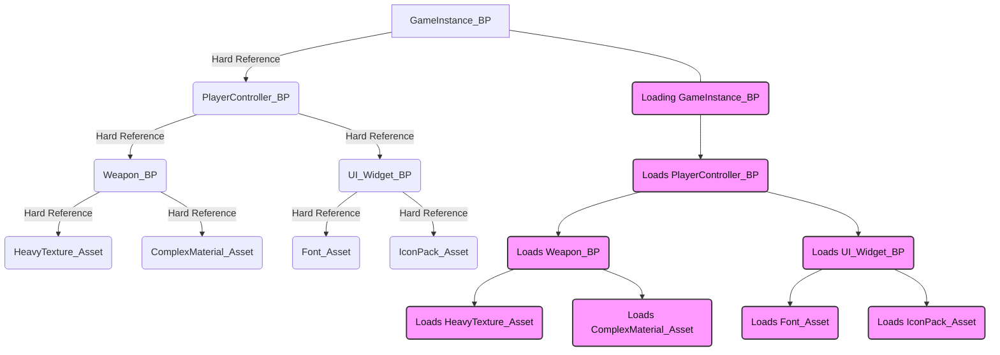

# A Brief Intro to the Issue

Unreal Engine's Blueprint visual scripting system stands as a cornerstone of its accessibility and rapid prototyping capabilities, empowering a broad spectrum of developers, from artists to programmers, to bring their visions to life. However, beneath this veneer of ease, a fundamental design choice in Blueprint's asset dependency management creates a significant burden. The engine's default behavior forces an eager loading paradigm, where all assets referenced by a Blueprint are pulled into memory when the referencing Blueprint itself is loaded. This report will dissect this problematic model, expose its far-reaching consequences on performance, memory, and project stability, contrast it with more efficient strategies employed by other leading game engines and programming languages, and ultimately argue for a necessary architectural evolution to empower Blueprint developers.

## Unreal Engine's Blueprint Dependency Model: An Unintended Burden

Unreal Engine (UE) automatically handles asset loading and unloading, aiming to simplify content management for [developers](https://dev.epicgames.com/documentation/en-us/unreal-engine/asset-management-in-unreal-engine). Within this system, two primary types of references dictate how assets are brought into memory: hard references and soft references. Understanding their distinctions is crucial to grasping the core challenge of Blueprint development.

### Defining Hard vs. Soft References in Unreal Engine

Hard references are direct pointers to an asset, object, or class, typically established at compile-time, as explained in detail by [Quod Soler's guide to references](https://www.quodsoler.com/blog/understanding-hard-references-and-soft-references-in-unreal-engine). Examples include `UObject*` or `TSubclassOf<UObject>` properties. A critical characteristic of hard references is that if the asset they point to is deleted or moved, the project will fail to compile or experience runtime errors, as outlined in the [Unreal Community Wiki](https://unrealcommunity.wiki/pointer-types-m33pysxg). More importantly, when an object containing a hard `UObject` pointer property is loaded—whether by being placed in a map or referenced by a game information class—the referenced asset is automatically loaded into memory, according to [Epic's documentation on asynchronous loading](https://dev.epicgames.com/documentation/en-us/unreal-engine/asynchronous-asset-loading-in-unreal-engine). This means that the mere existence of a hard reference dictates the immediate loading of the referenced content.

**The important distinction here is that loading a class definition itself is typically quite cheap and normal**—what's insane is the implicit loading of all assets referenced by that class at initialization time, based on a pre-compiled dependency tree, rather than loading assets only when explicitly requested or instantiated by the Blueprint developer.

In contrast, soft references, such as `FSoftObjectPath`, `TSoftObjectPtr`, or `TSoftClassPtr`, are indirect pointers that store a string path to an asset and are resolved and loaded at runtime. This indirectness allows the code to compile even if the referenced asset is missing, providing greater flexibility. Soft references are specifically designed for scenarios where assets are not immediately needed or require on-demand loading, preventing the automatic loading that hard pointers enforce. They offer artists and designers a similar user interface experience to hard pointers within the editor, but without the forced immediate loading of the referenced asset, as detailed in [forum discussions about soft references](https://forums.unrealengine.com/t/can-someone-explain-soft-variable-references/444524).

However, a subtle yet critical nuance exists within Unreal's soft reference implementation. While the value of a soft reference variable does not create a hard reference, the type of the soft reference variable (e.g., `TSoftObjectPtr<BP_TestChildActor>`) will still create a hard reference to that class definition. This means the Blueprint class itself is loaded, even if the specific instance of the asset is set to null, as discussed in [this forum thread about C++ vs Blueprint dependencies](https://forums.unrealengine.com/t/blueprints-can-develop-a-hard-reference-dependancy-chain-but-c-derived-classes-do-not/747439). To completely mitigate this, developers are often compelled to use a C++ base class or a Blueprint Interface as the variable type, adding a layer of architectural complexity.

### The Default Blueprint Behavior: Eager Loading of All Referenced Assets

Unreal Engine's Blueprint system, by default, treats most direct references as hard dependencies, as extensively documented in [community discussions about casting efficiency](https://forums.unrealengine.com/t/why-c-casting-is-more-efficient-for-memory-and-blueprint-casting-not/2059434). This implies that when a Blueprint class is loaded into memory, it automatically pulls in all other assets and classes that it hard-references, forming an extensive "hard reference dependency chain," as explained in [raharudev's guide to avoiding hard references](https://raharuu.github.io/unreal/hard-references-reasons-avoid/). This chain is not merely direct; it propagates recursively. If Blueprint A references Blueprint B, and Blueprint B in turn references Blueprint C, loading Blueprint A will cause both B and C to be loaded, irrespective of whether C is immediately required or utilized in the current context.

This behavior is particularly evident with common Blueprint nodes such as "Cast To," "Get All Actors of Class," or "Get Actor of Class". If a "Cast To" node references a specific Blueprint type, that Blueprint type and all its hard references are loaded. This occurs even if no object of that type exists in the current level, or if the cast operation itself never succeeds during execution. 

**The fundamental absurdity here is that this entire complex system of implicit asset loading exists seemingly to save developers from using a single node or handful of nodes**—specifically, the "Construct Object from Class" node and similar explicit loading mechanisms that already exist in the Blueprint system. These nodes would allow developers to explicitly control when assets are loaded, making the behavior completely transparent and predictable.

The engine's default architectural choice prioritizes immediate ease of use, making direct referencing the most straightforward option for designers and artists. This approach, while simplifying initial development by abstracting away explicit asset loading, inadvertently encourages development patterns that lead to massive asset loading, memory bloat, and performance issues as a project scales, as highlighted in [Reddit discussions about hard and soft references](https://www.reddit.com/r/unrealengine/comments/1bqbhwi/about_hard_and_soft_references/). The convenience of direct, hard referencing in Blueprints directly causes the widespread adoption of patterns that result in extensive hard dependencies, which in turn causes the observed performance and memory problems. Developers are thus forced to actively counteract the engine's default behavior to achieve optimal performance, rather than benefiting from performance-conscious defaults or more intuitive lazy loading mechanisms.

### Why this approach is often fundamentally flawed for Blueprints

The characterization of this behavior as confusing or sometimes altogether missed by developers stems from the profound practical consequences of this eager loading model. It can lead to scenarios where, as developers report, "100% of your assets" are loaded at game startup, or result in "a few gigs of memory out of nowhere" due to the extensive, often unforeseen, dependency chains that Blueprints create. This problem is not limited to direct dependencies; it's a transitive closure issue. A seemingly small, local reference in a Blueprint can trigger the loading of a vast and deep graph of assets, leading to disproportionate memory usage and prolonged load times, making it exceedingly difficult to predict and manage asset loading without meticulous inspection of the reference graph.

Epic Games states in their [Blueprint vs C++ documentation](https://dev.epicgames.com/documentation/en-us/unreal-engine/coding-in-unreal-engine-blueprint-vs.-cplusplus) that Blueprints were designed to have a "safe memory model to avoid crashes". However, this claim appears paradoxical when juxtaposed with the frequent reports of excessive memory usage, performance degradation, and even crashes due to circular dependencies in packaged builds, as discussed in [Reddit threads about circular dependencies](https://www.reddit.com/r/UnrealEngine5/comments/1huyn3x/avoid_circular_dependencies_in_blueprints/). The "safety" provided by Blueprints seems primarily focused on preventing low-level C++ memory errors like dangling pointers by enforcing automatic garbage collection and eager loading, as analyzed in [discussions about garbage collection vs manual memory management](https://gist.github.com/tivrfoa/e1255e26762a67cf867119a1f372760f).

This form of safety, however, comes at the direct cost of control and efficiency at a higher level. By automatically loading everything to prevent potential runtime null pointers or missing assets, the engine trades one type of potential runtime crash for guaranteed memory bloat, increased load times, and performance hitches. This design compromise, while making Blueprints "safer" for non-programmers in a narrow sense, creates significant and complex challenges for performance-conscious developers striving to ship large-scale, optimized titles, as outlined in [critiques of Unreal Engine's disadvantages](https://www.reddit.com/r/unrealengine/comments/15sqto6/disadvantages_of_unreal_engine/). 

**The core issue is that all of this complexity and overhead exists to avoid requiring developers to explicitly load assets when they actually need to instantiate objects or to prevent the compiler from having to find the things that should be loaded**. This represents a fundamental misalignment of priorities—trading predictable, explicit behavior for implicit convenience and compiler simplicity that often becomes a significant burden as projects scale.

## The Tangible Costs: Performance, Memory, and Stability

The default eager loading behavior of Blueprints in Unreal Engine translates into concrete, measurable costs that impact development efficiency and the end-user experience. These costs manifest across memory consumption, load times, runtime performance, and editor stability.

### Memory Footprint Bloat

The most immediate and significant consequence of eager loading is a drastically increased memory footprint. Assets are unnecessarily pulled into memory simply because they are referenced, not because they are actively used in the current game context. This problem is particularly acute in large-scale projects. For instance, during Blueprint scanning in Visual Studio, the process has been observed to consume an astonishing amount of RAM. One developer reported in a [Visual Studio community issue](https://developercommunity.visualstudio.com/t/Unreal-Engine-Blueprint-scan-uses-massiv/10609697?sort=newest&topics=visual+studio+2019&WT.mc_id=WD-MVP-5003763) that scanning 7,000 Blueprints used approximately 70GB of RAM, with a projection of over 150GB for 13,000 Blueprints. 

This demonstrates a linear increase in memory usage per Blueprint during scanning, highlighting the sheer size and complexity of the dependency graph that the engine must process. While this is an editor-specific issue, it serves as a direct and strong indicator of the underlying architectural problem: if the editor struggles to even scan these dependencies due to memory constraints, it is highly probable that the runtime loading of a subset of that graph will also be disproportionately large and slow. The fundamental architectural choice that leads to the creation of massive, interconnected dependency graphs causes both the observed editor memory issues and the eventual runtime memory and loading issues.

### Load Time Spikes

The automatic loading of extensive dependency chains directly translates into prolonged load times. This impacts various stages of a game, including initial game startup, seamless level transitions, and even the responsiveness of opening Blueprints within the Unreal Editor itself. In packaged builds, these issues are often exacerbated, with reports of "load times taking significantly longer" and even "instant-crashes" when opening Blueprints due to underlying dependency problems, as documented in [forum discussions about circular dependencies](https://forums.unrealengine.com/t/circular-dependency-blueprints/327105).

The problem is rarely a single egregious hard reference, but rather the aggregation of many small, seemingly innocuous hard references scattered across a large-scale project. Each "Cast To" node or direct object reference, if not meticulously managed with soft pointers or interfaces, contributes incrementally to the overall load burden. This "death by a thousand cuts" makes the issue difficult to pinpoint, requiring a comprehensive, systemic architectural discipline rather than isolated fixes. This cumulative burden makes large-scale Blueprint-only projects inherently challenging to optimize for loading and memory, often necessitating more C++ integration or complex, manual workarounds.

### Runtime Performance Overhead

Beyond just memory and load times, the Blueprint Virtual Machine (VM) itself introduces an inherent overhead compared to native C++ code. Blueprints are compiled into custom bytecode and interpreted by a virtual machine (VM) at runtime, whereas C++ code is compiled directly into machine code that runs natively on the CPU, as detailed in [SYNAPSE STUDIO's Blueprint performance analysis](https://synapse.crdg.jp/2025/06/12/blueprint-performance-demystified/). This additional layer of interpretation inherently leads to slower execution times for Blueprint logic. Furthermore, the act of "casting to a Blueprint type" in Blueprint logic not only adds that Blueprint as a dependency but also ensures it is always loaded before the root Blueprint and stays loaded while referenced, contributing to persistent memory and performance overhead during gameplay.

### Editor Instability and Circular Dependencies

Unreal Engine's Blueprint system, unlike C++, permits circular dependencies (where two assets reference each other) to exist within the editor environment. While a project might appear to function correctly in the editor, these circular dependencies can lead to severe issues such as "stack overflow exceptions in a packaged build" and game crashes in shipping products. These problems also manifest as significant editor instability, causing "awful lot of grief and wasted time" and "editor crashes" when developers attempt to compile Blueprints, as extensively discussed in [Blueprint circular dependency forum threads](https://forums.unrealengine.com/t/blueprint-circular-dependencies/410482).

Developers have been forced to implement various workarounds, such as using Blueprint Interfaces to break these cycles or even disabling the Blueprint compilation manager in project settings to prevent crashes. The engine's "forgiveness" of circular dependencies in the editor creates a false sense of security for Blueprint developers, allowing for the creation of complex, tightly coupled Blueprint systems that appear functional during development but are inherently fragile and prone to breaking in production. The problem is not just that crashes occur, but that the underlying architectural flaws are masked until critical stages like packaging, forcing developers into a reactive debugging cycle rather than enabling proactive, robust design from the outset.

The following table summarizes the observed impacts of Blueprint hard dependencies on critical development and runtime metrics:

| Impact Area | Observed Effect | 
|-------------|-----------------|
| Memory Footprint | Increased memory load; "100% assets loaded" at startup; "few gigs of memory out of nowhere" |
| Load Times (Game Startup) | "Significantly longer" load times; "instant-crashes" in packaged builds |
| Load Times (Level Streaming) | Prolonged level loading due to recursive dependency chains |
| Editor Performance (Blueprint Scan) | "Huge amount of memory" (e.g., 70GB for 7k BPs, projected 150GB+ for 13k BPs); Linear memory increase per Blueprint during scan |

**Table 1: Blueprint Hard Dependency Impact on Memory & Load Times**

## C++ as a Mitigator: A Developer's Workaround

Given the inherent challenges of Blueprint's default dependency model, developers often turn to C++ and specific architectural patterns as a means to mitigate the performance and memory overheads. These approaches, while effective, often introduce additional complexity to the development workflow.

### C++ Class References: The Lightweight Alternative

In stark contrast to Blueprints, C++ class references are generally not treated as asset dependencies in the same manner. **C++ classes are typically initialized at the start of the application and are considered "tiny," meaning they do not incur the same significant loading overhead as Blueprint assets**. This is the normal, expected behavior—loading class definitions is cheap and reasonable. The problem with Blueprints is not loading the class definitions themselves, but the implicit loading of all assets referenced by those classes.

When a Blueprint casts to a C++ base class, it does not trigger the loading of assets, as the C++ class itself does not directly contain asset references. Any asset references are usually declared in C++ but are populated and managed within child Blueprints, ensuring that the C++ layer remains lean and performant. This makes C++ the de facto "escape hatch" or "optimization layer" for Blueprint-heavy projects that encounter performance and memory bottlenecks. 

This often forces a two-tiered development paradigm: rapid prototyping in Blueprint, followed by a costly refactoring or re-parenting process to C++ to address issues that could have been mitigated with better default Blueprint behavior, as discussed in [Epic's documentation on balancing Blueprint and C++](https://dev.epicgames.com/documentation/en-us/unreal-engine/balancing-blueprint-and-cplusplus?application_version=4.27). This is not merely a choice but frequently a necessary, reactive step for shipping large-scale, performant games, as analyzed in [Codefinity's comparison of Blueprints vs C++](https://codefinity.com/blog/Blueprints-vs.-C-plus-plus-in-Unreal-Engine).

### Strategic Use of C++ Base Classes and Interfaces to Break Dependencies

A common and effective architectural pattern to manage Blueprint dependencies involves defining a base C++ class that declares the Application Programming Interface (API), including functions and events, for an object. Child Blueprints then inherit from this C++ base class and implement the specialized functionality and asset references. This allows Blueprints to interact through the lightweight C++ parent without creating hard references to each other's specific Blueprint implementations, thereby reducing direct Blueprint-to-Blueprint dependencies.

Blueprint Interfaces offer another powerful mechanism. By their very nature, interfaces cannot reference assets, making them an ideal tool to break circular dependencies and avoid unnecessary asset loading. They enable Blueprints to communicate and call functions on different target types without direct knowledge of the concrete Blueprint class, thus preventing the formation of problematic hard references. 

While functionally effective, a heavy reliance on interfaces or C++ base classes introduces an additional layer of architectural abstraction and complexity for Blueprint-centric teams. This "interface tax" demands more upfront design, adherence to specific communication patterns, and can make the visual scripting flow less direct or intuitive compared to simple direct references. This effectively diminishes some of the core benefits of Blueprint (simplicity, directness, visual clarity) in the pursuit of performance and stability, pushing Blueprint developers to adopt C++-like architectural patterns without always having the full benefits or robust debugging tools of C++.

### Soft Object References: The Manual Solution

Unreal Engine provides `FSoftObjectPath` and `TSoftObjectPtr` as explicit mechanisms to store references to assets without forcing their immediate loading. These are indirect pointers that necessitate an extra lookup at runtime to find and load the asset on demand. Artists and designers can utilize these types in the editor, benefiting from a similar user interface experience to hard pointers, but without triggering automatic loading. However, developers must then manually manage the asynchronous loading process using the `FStreamableManager`.

As previously discussed, a subtle but critical flaw is that even when using soft references, the type of a soft reference variable can still create a hard reference to the class itself, requiring further architectural considerations like using C++ base classes or interfaces for the variable type to achieve true lazy loading. This means that even with soft references, developers are burdened with manually managing the asynchronous loading and unloading process. This introduces significant boilerplate code and complexity into Blueprint logic, especially for managing loading states, callbacks, and potential failures. The "soft" nature is often only for the value of the reference, not always the type, requiring further architectural workarounds to achieve true lazy loading. This forces Blueprint developers to implement explicit loading logic that other engines frequently abstract away or handle more intelligently by default.

### Blueprint Nativization: A Performance Boost, Not a Dependency Fix

Blueprint Nativization is a feature designed to convert Blueprint bytecode into native C++ code during the packaging process, as detailed in [Epic's nativization documentation](https://dev.epicgames.com/documentation/en-us/unreal-engine/nativizing-blueprints?application_version=4.27). Its primary goal is to reduce the runtime Virtual Machine (VM) overhead and improve performance by replacing Blueprint Classes with newly generated native C++ classes that are compiled with the project.

While nativization can significantly enhance the execution speed of Blueprint logic, it is crucial to understand that it does not fundamentally solve the eager loading dependency problem. The resulting executable will be compiled with additional machine instructions, dependencies, and embedded metadata, leading to an increased executable size. More importantly, all supported dependencies required to build the nativized Blueprints will also be flagged for nativization and thus included in the compiled output. This means the underlying dependency graph still dictates what gets loaded, even if the execution itself is faster. Therefore, nativization primarily addresses the execution speed of Blueprint logic by eliminating the virtual machine overhead. It does not solve the underlying eager loading and dependency bloat problem, acting more as a performance optimization for logic execution rather than a solution for efficient asset loading and memory management. It functions as a band-aid for one symptom while leaving the core dependency issue unaddressed.

The following table outlines the various workarounds available to Blueprint developers and the associated trade-offs:

| Workaround | Primary Benefit | Key Trade-offs/Complexity |
|------------|-----------------|---------------------------|
| C++ Base Classes | Breaks circular dependencies, reduces asset loading by keeping C++ lean | Requires C++ knowledge, re-parenting Blueprints, adds architectural layers |
| Blueprint Interfaces | Enables communication without direct references, breaks circular dependencies | Adds architectural abstraction, can make visual scripting less direct |
| Soft Object References (FSoftObjectPath, TSoftObjectPtr) | Enables on-demand asset loading, prevents immediate memory bloat | Requires manual loading/unloading logic (FStreamableManager), variable type can still hard reference the class |
| Blueprint Nativization | Reduces Blueprint VM overhead, improves runtime execution speed | Increases executable size, does not solve underlying loading dependency bloat, still includes all dependencies |

**Table 2: Blueprint Dependency Workarounds and Their Trade-offs**

## Industry Benchmarks: Smarter Dependency Management in Other Engines

The challenges faced by Unreal Engine Blueprint developers regarding hard dependencies are not universal across the game development industry. Other leading engines and programming paradigms offer more sophisticated and developer-friendly approaches to asset and code loading, often prioritizing efficiency and control by default.

### Unity's Addressables: A Robust System for Asynchronous and On-Demand Loading

Unity's [Addressables system](https://docs.unity3d.com/Packages/com.unity.addressables@1.19/manual/index.html) represents a high-level content management solution designed to streamline asset loading and management. It empowers developers to load assets by their assigned "address," abstracting away the complexities of whether the asset is stored locally within the application or on a remote content delivery network. A key strength of Addressables lies in its automatic dependency management. When an asset is requested, the system ensures that all its associated dependencies—such as meshes, shaders, animations, and other related assets—are loaded before the requested content is returned to the application. This proactive approach prevents partial loading issues and ensures that the content is fully ready for use upon retrieval.

This contrasts sharply with Unreal's Blueprint default, which often requires developers to implement complex, manual workarounds (soft pointers, interfaces, C++ layering) to achieve similar levels of efficiency. Unity's approach embodies a "smart default" design philosophy; it provides an intuitive API (loading by address) while internally managing complex, performance-critical tasks like asynchronous loading, dependency resolution, and memory management. This empowers developers by abstracting away complexity and providing performant defaults, whereas Unreal's often exposes this complexity as a significant burden. Furthermore, Addressables efficiently packages AssetBundles, even with asset renames or moves, supporting dynamic content delivery (DLC) and reducing initial build sizes. It also incorporates automatic reference counting for memory management and provides a robust profiler to identify memory-related problems.

### Godot's ResourceLoader: Efficient Caching and Threaded Resource Management

Godot Engine's [ResourceLoader](https://docs.godotengine.org/en/stable/classes/class_resourceloader.html) is a central singleton responsible for loading all resource files, utilizing various ResourceFormatLoader classes to handle different file types and convert them for engine use. Once a resource is loaded, it is automatically cached in memory, ensuring faster access for subsequent requests. Developers can explicitly check for cached resources (`has_cached`, `get_cached_ref`) or override them.

Godot offers `load_threaded_request` for asynchronous, non-blocking asset loading, with options for using sub-threads for faster, parallel loading. It also provides granular control over caching behavior during loading through various CacheMode options. Developers can also query the dependencies of a resource using `get_dependencies`, allowing for proactive management and understanding of the asset graph. Godot strikes an effective balance between automated efficiency (e.g., automatic caching of loaded resources, implicit handling of basic script dependencies) and granular developer control (e.g., explicit threaded loading, detailed cache modes, the ability to query dependencies). This design allows developers to leverage automated optimizations for common cases while providing the necessary tools to understand, diagnose, and influence the loading process when fine-tuning performance is required. This contrasts with Unreal's Blueprint model, where developers are often surprised by side effects and forced into complex manual solutions for basic asset management.

### General Principles of Dynamic Loading: Lessons from C++ and Rust

Core programming languages like C++ and Rust have long-established mechanisms for dynamic linking, which allows code modules (libraries) to be loaded at runtime. This approach promotes code reuse, reduces memory footprint (as libraries can be shared across multiple applications or parts of the same application), and simplifies maintenance, as explained in [GeeksforGeeks' guide to dynamic libraries](https://www.geeksforgeeks.org/cpp/how-to-create-a-dynamic-library-in-cpp/).

A key concept in dynamic linking is "lazy loading," where dependencies are loaded only when they are explicitly referenced for the first time, rather than immediately upon the main object's initialization, as detailed in [Oracle's documentation on lazy loading](https://docs.oracle.com/cd/E19120-01/open.solaris/819-0690/chapter3-7/index.html). This prevents unnecessary loading of code or data that might never be used in a given execution path. C++ provides mechanisms like `dlopen()` (UNIX) or `LoadLibrary()` (Windows) and `dlsym()`/`GetProcAddress()` to explicitly load shared libraries and resolve symbols (functions, variables, classes) at runtime, offering maximum control over when and how dependencies are brought into memory, as demonstrated in [practical examples of dynamic loading](https://mprtmma.medium.com/c-shared-library-dynamic-loading-eps-2-28f0a109250a). Rust, while often emphasizing static linking for single binaries by default, fully supports dynamic libraries (`dylib`, `cdylib`) for scenarios requiring shared code or plugins, demonstrating that modern compiled languages provide robust solutions for dynamic dependency management, as outlined in [Rust's linkage documentation](https://doc.rust-lang.org/reference/linkage.html).

The nature of Blueprint dependencies stems from a fundamental architectural mismatch. Blueprints aim to provide the ease and flexibility of a scripting language but, in their default asset loading behavior, inherit the rigid, eager loading characteristics often associated with statically linked binaries in compiled languages (where all code and data is bundled upfront). However, even modern compiled languages (C++, Rust) offer sophisticated dynamic linking and lazy loading capabilities. Unreal's Blueprint VM, while providing a "safer" execution environment, does not seem to fully leverage the dynamic and on-demand loading paradigms that are common in both modern compiled languages and other scripting-heavy game engines. This suggests a design choice that, perhaps in pursuit of perceived simplicity or safety, inadvertently sacrifices dynamic flexibility, leading to the current performance and memory challenges. The core problem is not that Blueprints are a scripting language, but that their loading model has not evolved to fully embrace the benefits of dynamic, on-demand loading that even traditionally "static" languages have mastered.

The following table provides a comparative analysis of asset loading philosophies across different engines and programming contexts:

| Engine/Context | Default Loading Behavior | Dependency Resolution | Developer Control | Key Benefit |
|----------------|--------------------------|----------------------|-------------------|-------------|
| Unreal Blueprint | Eager (Hard References) | Transitive closure (often hidden and problematic) | Limited (requires manual workarounds) | Rapid prototyping & accessibility |
| Unreal C++ | Initialized at App Startup (class-level, tiny) | No asset dependencies (class-level); asset references handled by child Blueprints | High (explicit code) | Performance & low memory footprint |
| Unity Addressables | On-demand (Automatic with explicit API calls) | Automatic & Explicit API | High (abstracted API) | Streamlined content delivery & memory management |
| Godot ResourceLoader | Cached & On-demand (Explicit API) | Explicit API & Caching | High (granular API) | Balance of control & automation |
| General Dynamic Linking (C++/Rust) | Lazy (on-demand) or Explicit Runtime Loading | Explicit via linker/runtime calls | Very High (low-level control) | Code reuse, reduced memory, modularity |

**Table 3: Comparative Analysis of Asset Loading Philosophies**

## Visualizing the Problem: Blueprint Dependencies and Memory

To further illustrate the nature of Blueprint dependencies, consider the following diagrams.

### Blueprint Hard Reference Dependency Chain

This diagram shows how a seemingly simple hard reference in a top-level Blueprint can pull in a vast network of assets, even if they are not immediately needed.



**Explanation:** In this scenario, simply loading the GameInstance_BP (which might be loaded at game startup) triggers the loading of PlayerController_BP. Loading class definitions themselves is normal and typically very cheap—most engines and languages do this as part of initialization. What is abnormal in Unreal's Blueprint system is that all referenced asset data (textures, materials, fonts, icons, etc.) is also loaded immediately and transitively, regardless of whether those assets are actually needed at that moment. This eager, asset-level loading—rather than just class metadata—is the primary cause of memory bloat and slow startup times.

### Memory Impact: Eager vs. Lazy Loading

This diagram illustrates the difference in memory consumption between Unreal's default eager loading for Blueprints and a more optimized lazy loading approach.

```mermaid
graph TD
    subgraph "Eager Loading (Unreal Blueprint Default)"
        UE_Start[Game Start] --> UE_LoadAll(Load GameInstance_BP)
        UE_LoadAll --> UE_MemoryFull(Memory: Full of Assets)
        UE_MemoryFull --> UE_Gameplay(Gameplay: High RAM, Potential Stutters)
        UE_MemoryFull -- Unused Assets --> UE_Bloat(Memory Bloat)
    end

    subgraph "Lazy Loading (Ideal/Other Engines)"
        Other_Start[Game Start] --> Other_LoadCore(Load Core Systems Only)
        Other_LoadCore --> Other_MemoryLean(Memory: Lean)
        Other_Gameplay(Gameplay: On-Demand Loading)
        Other_MemoryLean -- Request Weapon --> Other_LoadWeapon(Load Weapon_BP & Assets)
        Other_LoadWeapon --> Other_Gameplay
        Other_MemoryLean -- Request UI --> Other_LoadUI(Load UI_Widget_BP & Assets)
        Other_LoadUI --> Other_Gameplay
    end

    style UE_MemoryFull fill:#f88,stroke:#333,color:#111,stroke-width:2px
    style UE_Bloat fill:#f88,stroke:#333,color:#111,stroke-width:2px
    style Other_MemoryLean fill:#8f8,stroke:#333,color:#111,stroke-width:2px
```



**Explanation:** The "Eager Loading" path, typical of Unreal Blueprints, shows that at game startup, a large portion of assets are loaded into memory, leading to memory bloat and potential performance issues during gameplay. In contrast, the "Lazy Loading" approach, common in other engines, loads only essential core systems at startup, keeping memory lean. Assets like Weapon_BP or UI_Widget_BP are only loaded when explicitly requested during gameplay, optimizing memory usage and reducing initial load times.

## Modern Memory Management: Lessons from Rust

Rust, a language increasingly popular for performance-critical applications, offers a compelling alternative to traditional garbage collection or manual memory management through its unique ownership and borrowing system. This system ensures memory safety and efficient resource management at compile time, without the runtime overhead of a garbage collector or the pitfalls of manual memory deallocation.

### Rust's Ownership and Borrowing Model

In Rust, every value has a single "owner." When the owner goes out of scope, the value is automatically "dropped," and its memory is freed. This eliminates the need for explicit malloc/free or new/delete calls, preventing memory leaks and dangling pointers at compile time, as explained in [comprehensive guides to Rust memory management](https://dev.to/pratikcodes/understanding-memory-management-in-rust-48pi).

**Ownership and Move Semantics:**

When a value is assigned to another variable, ownership is "moved" to the new variable, invalidating the original variable. This ensures there's always only one owner, preventing double-frees.

```rust
fn main() {
    let s1 = String::from("hello"); // s1 owns the string "hello"
    let s2 = s1;                    // Ownership moves from s1 to s2

    println!("{}", s2);             // Works fine
    // println!("{}", s1);          // ERROR: s1 is no longer valid (compile-time error)
}
```

**Explanation:** Unlike C++ where s1 = s2 would create a copy, in Rust, s1's ownership of the string data is moved to s2. s1 can no longer be used, preventing potential issues if s1 were to try to free the memory after s2 had already taken ownership.

**Borrowing (References):**

To allow multiple parts of a program to access data without transferring ownership, Rust uses "borrowing" via references (&). References can be immutable (read-only) or mutable (read-and-write). Rust's "borrow checker" enforces strict rules at compile time:

- You can have multiple immutable references to data.
- You can have only one mutable reference to data at a time.
- You cannot have a mutable reference while immutable references exist.

```rust
fn calculate_length(s: &String) -> usize { // s is an immutable borrow
    s.len() // Read-only access
}

fn change(s: &mut String) { // s is a mutable borrow
    s.push_str(", world"); // Modifying s
}

fn main() {
    let s = String::from("hello");
    let len = calculate_length(&s); // s is immutably borrowed, s is still valid
    println!("The length of '{}' is {}.", s, len); // s is still valid

    let mut s_mut = String::from("hello");
    change(&mut s_mut); // s_mut is mutably borrowed, allowing modification
    println!("{}", s_mut); // s_mut is now "hello, world"

    // Example of compile-time error due to borrowing rules:
    let mut s_error = String::from("error");
    let r1 = &s_error; // Immutable borrow
    // let r2 = &mut s_error; // ERROR: cannot borrow `s_error` as mutable because it is also borrowed as immutable
    println!("{}", r1);
}
```

**Explanation:** This demonstrates how Rust allows safe, concurrent reads (multiple immutable borrows) but enforces exclusive write access (single mutable borrow). This compile-time checking prevents data races and other memory-related bugs that often plague C++ development and are implicitly handled by Unreal's runtime GC, as detailed in [discussions of Rust ownership and borrowing](https://dev.to/leapcell/rust-ownership-and-borrowing-explained-22l6).

**Lifetimes:**

Rust's lifetime system tracks the scope for which a reference is valid, ensuring that references never outlive the data they point to. This prevents "dangling pointers" at compile time, as explained in [comprehensive lifetime guides](https://earthly.dev/blog/rust-lifetimes-ownership-burrowing/).

```rust
fn main() {
    let r; // Declare a reference
    {
        let x = 5; // `x` is created
        r = &x;    // `r` borrows `x`
    } // `x` goes out of scope and is dropped
    // println!("{}", r); // ERROR: `r` points to invalid memory (compile-time error)
}
```

**Explanation:** The Rust compiler immediately flags this as an error because r would point to memory that has already been freed when x goes out of scope. This compile-time guarantee is a cornerstone of Rust's memory safety.

### Contrast with Unreal Engine's Approach

Rust's ownership and borrowing model provides deterministic memory management, where developers know precisely when resources are allocated and deallocated, without the need for a runtime garbage collector, as discussed in [various programming community comparisons](https://news.ycombinator.com/item?id=12223521). This contrasts with Unreal Engine's UObject garbage collection, which, while providing automatic memory management, can introduce non-deterministic pauses and performance hitches during gameplay due to its reachability analysis, as detailed in [Epic's documentation on incremental garbage collection](https://dev.epicgames.com/documentation/en-us/unreal-engine/incremental-garbage-collection-in-unreal-engine). 

While Unreal's GC is designed for safety and ease of use, particularly for UObjects, it trades off the fine-grained control and predictable performance that Rust's compile-time memory management offers. Furthermore, Rust's system inherently prevents many of the circular dependency issues that plague Unreal Blueprints, as its borrow checker would typically catch such patterns at compile time, forcing a more robust design from the outset.

## The Imperative for Change: Empowering Blueprint Developers

The current Blueprint dependency model in Unreal Engine, characterized by its eager loading defaults and fragile handling of circular references, creates significant technical debt that scales exponentially with project complexity. What begins as a tool for rapid prototyping quickly devolves into a constant struggle against memory bloat, prolonged load times, and editor instability.

The initial "ease of use" provided by Blueprints, particularly with their default hard references, creates a substantial technical debt that accrues exponentially as a project scales. What saves time in early prototyping (direct, implicit references) becomes a massive time sink in optimization, debugging, and refactoring for production. This means the perceived productivity gains of Blueprints are often offset by the hidden, long-term costs of managing their problematic dependency model in a large, shippable title. The nature of the current system is the painful realization of this deferred and often unavoidable cost.

This forces Blueprint developers into complex, often counter-intuitive workarounds—such as relying heavily on Blueprint Interfaces, establishing C++ base classes, or meticulously managing soft references manually—that erode the very benefits of visual scripting. This translates into an "awful lot of grief and wasted time" for development teams. The inability to easily manage asset loading within Blueprints without resorting to C++ or cumbersome manual processes limits the scalability of Blueprint-only projects and often forces a premature shift to a hybrid C++/Blueprint workflow, increasing overall development complexity and costs.

### A Vision for Improved Blueprint Dependency Management: No Implicit Loading

**The fundamental solution is simple: eliminate implicit asset loading entirely.** Instead of the current system where referencing a Blueprint class automatically loads all its assets, the engine should load only the class definitions (which are cheap) and require developers to explicitly load assets when needed using existing nodes like "Construct Object from Class."

This approach would provide several key benefits:

1. **No Implicit Behavior:** Asset loading would become completely transparent and predictable. Developers would know exactly when assets are loaded because they explicitly requested it.

2. **Leverage Existing Nodes:** Unreal already has perfectly functional nodes for explicit object construction and asset loading. The current system essentially bypasses these in favor of implicit loading that saves developers "a single node or handful of nodes"—a trade-off that often proves absurd when projects scale.

3. **Maintain Class Definition Loading:** Loading Blueprint class definitions themselves would remain fast and automatic, as this is normal and expected behavior. The problem is not loading class metadata, but loading all the heavy assets those classes reference.

4. **Developer Choice:** Developers who want the convenience of implicit loading could opt into it on a per-reference basis, while those who need performance could rely on explicit loading patterns.

### Enhanced Tooling and Validation

While eliminating implicit loading addresses the core issue, additional improvements would further empower Blueprint developers:

1. **Robust Dependency Validation:** The engine should implement stronger compile-time or editor-time validation for Blueprint dependencies. This would proactively prevent circular references from ever reaching packaged builds as crashes. More explicit warnings or errors within the editor, perhaps flagging potential runtime loading issues before packaging, would enable developers to address problems early in the development cycle.

2. **Enhanced Dependency Visualization:** While the existing [Reference Viewer](https://forums.unrealengine.com/t/dependency-graph/253279) is a useful starting point, more advanced tools are needed to visualize, analyze, and optimize complex Blueprint dependency graphs. Integrating [memory insights](https://dev.epicgames.com/documentation/en-us/unreal-engine/memory-insights-in-unreal-engine) directly into dependency analysis tools could provide developers with a clearer picture of memory consumption tied to specific Blueprint chains.

3. **Blueprint Packaging/Modules:** Exploring a concept akin to "Blueprint Packages" or modular Blueprint assets could allow developers to explicitly define and manage dependencies for collections of Blueprints, similar to how other engines handle asset bundles or how C++ handles modules. This would provide a clearer architectural boundary and control over loading units.

### A Call to Action for Epic Games: Prioritizing Blueprint Developer Experience

Blueprints are a key differentiator and a significant reason for Unreal Engine's widespread adoption, attracting a broad developer base, including those without extensive C++ experience. However, the current dependency management system fundamentally undermines this accessibility and the ability to scale for large, production-ready projects.

If Unreal Engine aims to maintain its dominance and appeal to a diverse range of developers (from indies to AAA studios, particularly those who rely heavily on visual scripting), addressing this fundamental architectural limitation is strategically vital. Ignoring it risks alienating a significant portion of its user base who depend on Blueprints for their core logic, potentially forcing them into extensive C++ development or even to consider alternative engines as their projects grow, as discussed in [gamedev community forums](https://www.reddit.com/r/gamedev/comments/xfchgf/when_will_epic_games_adopt_a_new_modern/) and [performance improvement discussions](https://forums.unrealengine.com/t/any-plan-to-improve-blueprint-vm-performance/120443).

While Epic Games' [roadmap mentions "Blueprint Improvements"](https://portal.productboard.com/epicgames/1-unreal-engine-public-roadmap/c/829-blueprint-improvements), addressing the core dependency loading model is paramount for the long-term health and scalability of the Blueprint ecosystem. The imperative is not just to fix bugs, but to fundamentally rethink the Blueprint asset loading philosophy to empower developers to build robust, performant, and scalable projects without constantly fighting the engine's inherent defaults. This is not merely a technical improvement but a competitive necessity for the long-term health and growth of the Blueprint ecosystem and Unreal Engine's market position, as analyzed in [industry comparisons](https://program-ace.com/blog/unreal-engine-blueprints-vs-c/).

**The core insight is that the entire complex ecosystem of workarounds, performance problems, and developer frustration stems from trying to save developers from using explicit loading nodes.** By embracing explicit loading as the default and making implicit loading an opt-in feature, Epic could eliminate the vast majority of Blueprint dependency issues while maintaining the visual scripting advantages that make Blueprints appealing in the first place.

## Works Cited

1. Asset Management in Unreal Engine - Epic Games Developers, accessed July 20, 2025, https://dev.epicgames.com/documentation/en-us/unreal-engine/asset-management-in-unreal-engine

2. Blueprint Performance Demystified - SYNAPSE STUDIO, accessed July 20, 2025, https://synapse.crdg.jp/2025/06/12/blueprint-performance-demystified/

3. Why C++ casting is more efficient (for memory) and blueprint casting ..., accessed July 20, 2025, https://forums.unrealengine.com/t/why-c-casting-is-more-efficient-for-memory-and-blueprint-casting-not/2059434

4. Understanding Hard References and Soft References in Unreal Engine | Quod Soler, accessed July 20, 2025, https://www.quodsoler.com/blog/understanding-hard-references-and-soft-references-in-unreal-engine

5. Pointer Types - Unreal Engine Community Wiki, accessed July 20, 2025, https://unrealcommunity.wiki/pointer-types-m33pysxg

6. Asynchronous Asset Loading in Unreal Engine | Unreal Engine 5.6 ..., accessed July 20, 2025, https://dev.epicgames.com/documentation/en-us/unreal-engine/asynchronous-asset-loading-in-unreal-engine

7. Can someone explain soft variable references? - Editor Scripting - Unreal Engine Forums, accessed July 20, 2025, https://forums.unrealengine.com/t/can-someone-explain-soft-variable-references/444524

8. Blueprints can develop a hard reference dependancy chain, but C++ derived classes do not? - Unreal Engine Forums, accessed July 20, 2025, https://forums.unrealengine.com/t/blueprints-can-develop-a-hard-reference-dependancy-chain-but-c-derived-classes-do-not/747439

9. Hard References & Reasons to Avoid Them - raharudev - Unreal Engine Development, accessed July 20, 2025, https://raharuu.github.io/unreal/hard-references-reasons-avoid/

10. About hard and soft references : r/unrealengine - Reddit, accessed July 20, 2025, https://www.reddit.com/r/unrealengine/comments/1bqbhwi/about_hard_and_soft_references/

11. Coding in Unreal Engine: Blueprint vs. C++ - Epic Games Developers, accessed July 20, 2025, https://dev.epicgames.com/documentation/en-us/unreal-engine/coding-in-unreal-engine-blueprint-vs.-cplusplus

12. Avoid circular dependencies in Blueprints! : r/UnrealEngine5 - Reddit, accessed July 20, 2025, https://www.reddit.com/r/UnrealEngine5/comments/1huyn3x/avoid_circular_dependencies_in_blueprints/

13. when does Garbage collection is faster than manual memory management? - GitHub Gist, accessed July 20, 2025, https://gist.github.com/tivrfoa/e1255e26762a67cf867119a1f372760f

14. Disadvantages of Unreal engine. : r/unrealengine - Reddit, accessed July 20, 2025, https://www.reddit.com/r/unrealengine/comments/15sqto6/disadvantages_of_unreal_engine/

15. Unreal Engine Blueprint scan uses massive amount of memory - Developer Community, accessed July 20, 2025, https://developercommunity.visualstudio.com/t/Unreal-Engine-Blueprint-scan-uses-massiv/10609697?sort=newest&topics=visual+studio+2019&WT.mc_id=WD-MVP-5003763

16. circular dependency blueprints - UI - Epic Developer Community Forums, accessed July 20, 2025, https://forums.unrealengine.com/t/circular-dependency-blueprints/327105

17. Anatomy of the Unreal 4 blueprint virtual machine - Gamedev Guide, accessed July 20, 2025, https://ikrima.dev/ue4guide/engine-programming/blueprints/bp-virtualmachine-overview/

18. Blueprint Circular Dependencies - Programming & Scripting - Unreal Engine Forums, accessed July 20, 2025, https://forums.unrealengine.com/t/blueprint-circular-dependencies/410482

19. Balancing Blueprint and C++ | Unreal Engine 4.27 Documentation - Epic Games Developers, accessed July 20, 2025, https://dev.epicgames.com/documentation/en-us/unreal-engine/balancing-blueprint-and-cplusplus?application_version=4.27

20. Blueprints vs. C++ in Unreal Engine - Codefinity, accessed July 20, 2025, https://codefinity.com/blog/Blueprints-vs.-C-plus-plus-in-Unreal-Engine

21. Nativizing Blueprints | Unreal Engine 4.27 Documentation | Epic Developer Community, accessed July 20, 2025, https://dev.epicgames.com/documentation/en-us/unreal-engine/nativizing-blueprints?application_version=4.27

22. Blueprint Nativization | Feature Highlight | Unreal Engine - YouTube, accessed July 20, 2025, https://www.youtube.com/watch?v=Ut_CRt7o8PA

23. Addressables | Addressables | 1.19.19 - Unity - Manual, accessed July 20, 2025, https://docs.unity3d.com/Packages/com.unity.addressables@1.19/manual/index.html

24. Addressables with Loading Bar in Unity (AWS) Part-1 | by OnurKiris - Medium, accessed July 20, 2025, https://medium.com/@onurkiris05/addressables-with-loading-bar-in-unity-aws-part-1-b382a952ac76

25. ResourceLoader --- Godot Engine (stable) documentation in English, accessed July 20, 2025, https://docs.godotengine.org/en/stable/classes/class_resourceloader.html

26. How to Create a Dynamic Library in C++? - GeeksforGeeks, accessed July 20, 2025, https://www.geeksforgeeks.org/cpp/how-to-create-a-dynamic-library-in-cpp/

27. Lazy Loading of Dynamic Dependencies (Linker and Libraries Guide), accessed July 20, 2025, https://docs.oracle.com/cd/E19120-01/open.solaris/819-0690/chapter3-7/index.html

28. C++ Shared Library: Dynamic Loading (Eps: 2) | by Muhammad Naufal Pratama - Medium, accessed July 20, 2025, https://mprtmma.medium.com/c-shared-library-dynamic-loading-eps-2-28f0a109250a

29. Linkage - The Rust Reference, accessed July 20, 2025, https://doc.rust-lang.org/reference/linkage.html

30. What is the current state of dynamic linking in Rust?, accessed July 20, 2025, https://users.rust-lang.org/t/what-is-the-current-state-of-dynamic-linking-in-rust/125332

31. Rust Lifetimes: A Complete Guide to Ownership and Borrowing - Earthly Blog, accessed July 20, 2025, https://earthly.dev/blog/rust-lifetimes-ownership-burrowing/

32. Understanding Memory Management in Rust - DEV Community, accessed July 20, 2025, https://dev.to/pratikcodes/understanding-memory-management-in-rust-48pi

33. Rust Ownership and Borrowing Explained - DEV Community, accessed July 20, 2025, https://dev.to/leapcell/rust-ownership-and-borrowing-explained-22l6

34. What is Ownership? - The Rust Programming Language, accessed July 20, 2025, https://doc.rust-lang.org/book/ch04-01-what-is-ownership.html

35. From this post, Crystal appears to have some of the things many people have been... | Hacker News, accessed July 20, 2025, https://news.ycombinator.com/item?id=12223521

36. dealing with GC/manual memory management and returning value/exceptions in rust, accessed July 20, 2025, https://www.reddit.com/r/rust/comments/191s9nl/dealing_with_gcmanual_memory_management_and/

37. Incremental Garbage Collection in Unreal Engine - Epic Games Developers, accessed July 20, 2025, https://dev.epicgames.com/documentation/en-us/unreal-engine/incremental-garbage-collection-in-unreal-engine

38. Primer: Debugging Garbage Collection Performance | Epic Developer Community, accessed July 20, 2025, https://dev.epicgames.com/community/learning/knowledge-base/xaY1/unreal-engine-primer-debugging-garbage-collection-performance

39. Dependency graph? - Blueprint - Epic Developer Community Forums, accessed July 20, 2025, https://forums.unrealengine.com/t/dependency-graph/253279

40. Memory Insights in Unreal Engine - Epic Games Developers, accessed July 20, 2025, https://dev.epicgames.com/documentation/en-us/unreal-engine/memory-insights-in-unreal-engine

41. When will Epic games adopt a new modern programming language for Unreal Engine? : r/gamedev - Reddit, accessed July 20, 2025, https://www.reddit.com/r/gamedev/comments/xfchgf/when_will_epic_games_adopt_a_new_modern/

42. Any plan to improve Blueprint VM performance? - Unreal Engine Forums, accessed July 20, 2025, https://forums.unrealengine.com/t/any-plan-to-improve-blueprint-vm-performance/120443

43. Blueprint Improvements - Unreal Engine Public Roadmap, accessed July 20, 2025, https://portal.productboard.com/epicgames/1-unreal-engine-public-roadmap/c/829-blueprint-improvements

44. Unreal Engine Blueprints vs. C++ - Program-Ace, accessed July 20, 2025, https://program-ace.com/blog/unreal-engine-blueprints-vs-c/