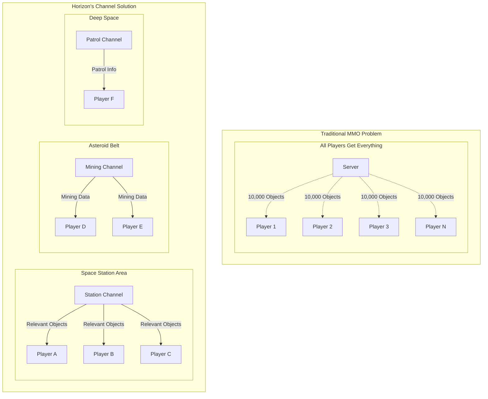
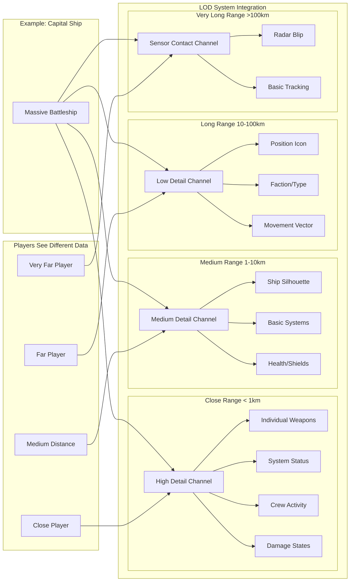
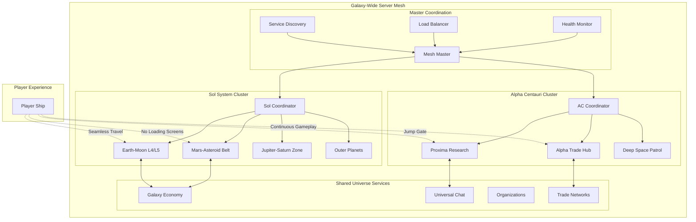

*The technical journey of building a game server that breaks Unreal Engine's limits and powers massive space battles*

## The Problem That Started Everything

Picture this: You're building an ambitious MMO space warfare game called **Stars Beyond**. You have grand visions of massive fleet battles with hundreds of players fighting across solar systems, dynamic economies spanning multiple star sectors, and persistent universes that feel truly alive. 

Then reality hits you like a cosmic freight train.

I remember the exact moment when I realized we had a fundamental problem. We were prototyping our space combat and ship building in diagrams and sketches over Discord, and everything looked incredible, the graphics concepts; stunning. But when we think about scale everything fell apart.

Unreal Engine's networking stack, for all its strengths in traditional multiplayer games, was buckling under the weight of our ambitions. Even with perfect optimization and prayers to the networking gods, you might squeeze 200 players out of a single Unreal server instance before everything falls apart. The frame rate dropped to single digits, players start teleporting around due to synchronization failures, and our beautiful space combat devolved into a slideshow of frustrated disconnections.

We needed hundreds of thousands, maybe millions.

## Why Not JavaScript?

As a web developer at heart, my first instinct was to reach for what I knew: JavaScript and Node.js. The event-driven nature seemed perfect for handling thousands of concurrent network connections, and I could prototype quickly. But after researching the performance requirements for what we wanted to build, I realized JavaScript would hit the same scaling wall that Unreal did, just for different reasons.

Stars Beyond broke every assumption that traditional networking was built on. Imagine a single solar system in our game: massive space stations with hundreds of docking bays, freight convoys with AI escorts, mining operations in asteroid belts, and epic fleet battles at jump gates. Each ship might have dozens of individually simulated components, and space naturally creates clustering - everyone wants to gather at the cool locations.

The math was brutal. A single large fleet engagement might involve 300 player ships, each with 20 networkable components, plus ammunition, plus environmental objects. That's potentially 10,000+ networked objects that need synchronization across hundreds of clients, multiple times per second.

JavaScript's single-threaded nature meant we'd be leaving 90% of modern server hardware unused while our single thread gasped under the computational load. We needed something that could utilize all available CPU cores, had predictable performance characteristics, and could handle the complexity of our systems without runtime surprises.

That's when I decided to learn Rust.

## Learning Rust: The Decision That Changed Everything

The decision to learn Rust felt like jumping off a cliff. Here I was, with people depending on me to deliver an ambitious MMO server, and a team of friends that would need good tooling to manage our project, and I was about to spend months learning a notoriously difficult programming language from scratch, and I was dragging the group with me. I had to make sure this was the right choice for us.

But the more I researched our requirements, the more convinced I became that Rust wasn't just a good choice - it was the only choice that could get us where we needed to go while keeping stability, and preventing undefined behavior.

The promise of Rust was almost too good to believe: performance that matched or exceeded C++, memory safety without garbage collection, fearless concurrency that could utilize all available CPU cores, and a type system that could catch errors at compile time that would otherwise explode in production with thousands of players connected.

### The First Month: Fighting for Understanding

My first real Rust program was trying to create a basic player management system. Coming from dynamic languages, Rust's ownership system felt like programming with mittens on:

```rust
// From our actual early codebase - this took me days to get right
#[derive(Debug, Clone, Copy, PartialEq, Eq, Hash, Serialize, Deserialize)]
pub struct PlayerId(pub Uuid);

impl PlayerId {
    pub fn new() -> Self {
        Self(Uuid::new_v4())
    }
}

#[derive(Debug, Clone, Serialize, Deserialize)]
pub struct Player {
    pub id: PlayerId,
    pub name: String,
    pub position: Position,
    pub metadata: HashMap<String, String>,
}

impl Player {
    pub fn new(name: String, position: Position) -> Self {
        Self {
            id: PlayerId::new(),
            name,
            position,
            metadata: HashMap::new(),
        }
    }
}
```

### Building the Foundation: Event-Driven Architecture

After many many itterations and rust projects taking up months of development. I grasped Rust's ownership model, I understood basic library loading, and I started building the core architecture that would eventually become Horizon. The heart of the system is an event-driven architecture that allows different game systems to communicate safely without tight coupling of plugins:

```rust
// From crates/event_system/src/lib.rs - our actual event system core
pub struct EventSystem {
    handlers: RwLock<HashMap<String, Vec<Arc<dyn EventHandler>>>>,
    stats: RwLock<EventSystemStats>,
}

impl EventSystem {
    pub fn new() -> Self {
        Self {
            handlers: RwLock::new(HashMap::new()),
            stats: RwLock::new(EventSystemStats::default()),
        }
    }
    
    /// Register a core server event handler
    pub async fn on_core<T, F>(&self, event_name: &str, handler: F) -> Result<(), EventError>
    where
        T: Event + 'static,
        F: Fn(T) -> Result<(), EventError> + Send + Sync + 'static,
    {
        let event_key = format!("core:{}", event_name);
        self.register_typed_handler(event_key, event_name, handler).await
    }
    
    /// Emit a core event with type safety
    pub async fn emit_core<T>(&self, event_name: &str, event: &T) -> Result<(), EventError>
    where
        T: Event,
    {
        let event_key = format!("core:{}", event_name);
        self.emit_event(&event_key, event).await
    }
}
```

This event system became the nervous system of our entire server. Instead of tightly coupled systems calling each other directly, everything communicates through strongly-typed events. The compiler guarantees that event handlers receive exactly the data they expect, eliminating entire categories of runtime errors.

### Type Safety That Scales

One of Rust's most powerful features for our use case is the type system. Instead of stringly-typed identifiers that could be mixed up at runtime, we could create distinct types that prevent entire categories of bugs:

```rust
// From our actual codebase - these types make bugs impossible
#[derive(Debug, Clone, Copy, PartialEq, Eq, Hash, Serialize, Deserialize)]
pub struct PlayerId(pub Uuid);

#[derive(Debug, Clone, Copy, PartialEq, Eq, Hash, Serialize, Deserialize)]
pub struct RegionId(pub Uuid);

#[derive(Debug, Clone, Copy, PartialEq, Serialize, Deserialize)]
pub struct Position {
    pub x: f64,
    pub y: f64,
    pub z: f64,
}

// This function can ONLY be called with a PlayerId - no mix-ups possible
pub async fn send_to_player(&self, player_id: PlayerId, data: &[u8]) -> Result<(), ServerError>;
```

The type system also enabled us to build complex event hierarchies with compile-time guarantees:

```rust
// From our event system - every event is strongly typed
#[derive(Debug, Clone, Serialize, Deserialize)]
pub struct PlayerConnectedEvent {
    pub player_id: PlayerId,
    pub connection_id: String,
    pub remote_addr: String,
    pub timestamp: u64,
}

#[derive(Debug, Clone, Serialize, Deserialize)]
pub struct PlayerDisconnectedEvent {
    pub player_id: PlayerId,
    pub connection_id: String,
    pub reason: DisconnectReason,
    pub timestamp: u64,
}

// The Event trait is automatically implemented for any type that meets the requirements
impl<T> Event for T
where
    T: Serialize + DeserializeOwned + Send + Sync + Any + std::fmt::Debug + 'static,
{
    fn type_name() -> &'static str {
        std::any::type_name::<T>()
    }
    
    fn serialize(&self) -> Result<Vec<u8>, EventError> {
        serde_json::to_vec(self).map_err(EventError::Serialization)
    }
    
    fn deserialize(data: &[u8]) -> Result<Self, EventError> {
        serde_json::from_slice(data).map_err(EventError::Deserialization)
    }
}
```

## The Plugins: Zero Unsafe Code

One of our biggest architectural wins was the plugin system. This took many, (many, (*many*)) attempts. Traditional game servers require plugins to be written in C++ with lots of unsafe code, making them difficult to develop and prone to crashes. Our Rust plugin system eliminates unsafe code entirely while providing better performance than traditional approaches.

Here's how developers can create plugins for Horizon:

```rust
// From crates/plugin_greeter/src/lib.rs - actual working plugin code
use event_system::{
    EventSystem, SimplePlugin, PluginError, ServerContext, 
    PlayerId, current_timestamp, create_simple_plugin, register_handlers
};

pub struct GreeterPlugin {
    name: String,
    welcome_count: u32,
}

impl GreeterPlugin {
    pub fn new() -> Self {
        Self {
            name: "greeter".to_string(),
            welcome_count: 0,
        }
    }
}

#[async_trait]
impl SimplePlugin for GreeterPlugin {
    fn name(&self) -> &str {
        &self.name
    }
    
    fn version(&self) -> &str {
        "1.0.0"
    }
    
    async fn register_handlers(&mut self, events: Arc<EventSystem>) -> Result<(), PluginError> {
        // Register event handlers using our clean macro syntax
        register_handlers!(events; 
            core {
                "player_connected" => |event: serde_json::Value| {
                    println!("👋 GreeterPlugin: New player connected! {:?}", event);
                    Ok(())
                },
                
                "player_disconnected" => |event: serde_json::Value| {
                    println!("👋 GreeterPlugin: Player disconnected. Farewell! {:?}", event);
                    Ok(())
                }
            }
            
            client {
                "chat", "message" => |event: serde_json::Value| {
                    if let Some(msg) = event.get("message") {
                        if msg.as_str().unwrap_or("").to_lowercase().contains("hello") {
                            println!("👋 GreeterPlugin: Detected greeting! Preparing response...");
                        }
                    }
                    Ok(())
                }
            }
        )?;
        
        Ok(())
    }
    
    async fn on_init(&mut self, context: Arc<dyn ServerContext>) -> Result<(), PluginError> {
        context.log(LogLevel::Info, "👋 GreeterPlugin: Starting up! Ready to welcome players!");
        Ok(())
    }
}

// Zero unsafe code! The macro handles everything safely
create_simple_plugin!(GreeterPlugin);
```

The `create_simple_plugin!` macro eliminates all the unsafe FFI code that traditionally plagues game server plugins:

```rust
// From crates/event_system/src/lib.rs - this macro removes all unsafe code from plugin development
#[macro_export]
macro_rules! create_simple_plugin {
    ($plugin_type:ty) => {
        struct PluginWrapper {
            inner: $plugin_type,
        }
        
        #[async_trait]
        impl Plugin for PluginWrapper {
            fn name(&self) -> &str {
                self.inner.name()
            }
            
            async fn pre_init(&mut self, context: Arc<dyn ServerContext>) -> Result<(), PluginError> {
                self.inner.register_handlers(context.events()).await
            }
            
            async fn init(&mut self, context: Arc<dyn ServerContext>) -> Result<(), PluginError> {
                self.inner.on_init(context).await
            }
        }
        
        #[no_mangle]
        pub unsafe extern "C" fn create_plugin() -> *mut dyn Plugin {
            let plugin = Box::new(PluginWrapper {
                inner: <$plugin_type>::new(),
            });
            Box::into_raw(plugin)
        }
        
        #[no_mangle]
        pub unsafe extern "C" fn destroy_plugin(plugin: *mut dyn Plugin) {
            if !plugin.is_null() {
                let _ = Box::from_raw(plugin);
            }
        }
    };
}
```

Plugin developers never see unsafe code - they just implement the `SimplePlugin` trait and use the macro. The system handles all the dynamic loading, memory management, and event routing safely.

## The Core Server: Infrastructure-Only Architecture

The heart of Horizon is intentionally minimal. The core server handles only essential infrastructure: connections, plugin management, and message routing. All game logic is delegated to plugins, creating a clean separation of concerns:

```rust
// From crates/game_server/src/lib.rs - our actual server core
pub struct GameServer {
    config: ServerConfig,
    event_system: Arc<EventSystem>,
    connection_manager: Arc<ConnectionManager>,
    shutdown_sender: broadcast::Sender<()>,
    region_id: RegionId,
}

impl GameServer {
    pub async fn start(&self) -> Result<(), ServerError> {
        info!("🚀 Starting game server on {}", self.config.bind_address);
        
        // Register minimal core event handlers
        self.register_core_handlers().await?;
        
        // Emit region started event (for plugins)
        self.event_system.emit_core("region_started", &RegionStartedEvent {
            region_id: self.region_id,
            bounds: self.config.region_bounds.clone(),
            timestamp: current_timestamp(),
        }).await.map_err(|e| ServerError::Internal(e.to_string()))?;
        
        // Start TCP listener for WebSocket connections
        let listener = TcpListener::bind(self.config.bind_address).await
            .map_err(|e| ServerError::Network(format!("Failed to bind: {}", e)))?;
        
        info!("🌐 Server listening on {}", self.config.bind_address);
        
        // Main server loop - handles only infrastructure
        let mut shutdown_receiver = self.shutdown_sender.subscribe();
        
        loop {
            tokio::select! {
                result = listener.accept() => {
                    match result {
                        Ok((stream, addr)) => {
                            let connection_manager = self.connection_manager.clone();
                            let event_system = self.event_system.clone();
                            
                            tokio::spawn(async move {
                                if let Err(e) = handle_connection(
                                    stream, addr, connection_manager, event_system,
                                ).await {
                                    error!("Connection error: {:?}", e);
                                }
                            });
                        }
                        Err(e) => error!("Failed to accept connection: {}", e),
                    }
                }
                
                _ = shutdown_receiver.recv() => {
                    info!("Shutdown signal received");
                    break;
                }
            }
        }
        
        Ok(())
    }
}
```

The server's job is to route messages to plugins, not implement game logic. When a client sends a message, the server parses it and emits the appropriate events:

```rust
// From our actual message routing system
/// Route raw client message to plugins (no game logic in core!)
async fn route_client_message(
    text: &str,
    connection_id: ConnectionId,
    connection_manager: &ConnectionManager,
    event_system: &EventSystem,
) -> Result<(), ServerError> {
    // Parse as generic message structure
    let message: ClientMessage = serde_json::from_str(text)
        .map_err(|e| ServerError::Network(format!("Invalid JSON: {}", e)))?;

    let player_id = connection_manager
        .get_player_id(connection_id)
        .await
        .ok_or_else(|| ServerError::Internal("Player not found".to_string()))?;

    debug!(
        "📨 Routing message to namespace '{}' event '{}' from player {}",
        message.namespace, message.event, player_id
    );

    // Create raw message event for plugins to handle
    let raw_event = RawClientMessageEvent {
        player_id,
        message_type: format!("{}:{}", message.namespace, message.event),
        data: message.data.to_string().into_bytes(),
        timestamp: current_timestamp(),
    };

    // Emit to core for routing (plugins will listen to this)
    event_system
        .emit_core("raw_client_message", &raw_event)
        .await
        .map_err(|e| ServerError::Internal(e.to_string()))?;

    // Generic routing using client-specified namespace and event
    event_system
        .emit_client(&message.namespace, &message.event, &message.data)
        .await
        .map_err(|e| ServerError::Internal(e.to_string()))?;

    info!(
        "✅ Routed '{}:{}' message from player {} to plugins",
        message.namespace, message.event, player_id
    );
    Ok(())
}
```

This architecture provides several key benefits: fault isolation (if a plugin crashes, it doesn't have to bring down the server), horizontal scaling (individual systems can be moved to separate processes), and development velocity (teams can work on different plugins simultaneously).

## The Channel Replication System: Smart Networking at Scale

The breakthrough that enabled Horizon to support thousands of concurrent players was our channel-based replication system. Instead of broadcasting every networked object to every connected client (which scales as O(N²)), we developed a system that intelligently manages who receives what information.



### Channel Architecture Implementation

Every object that can replicate data from the server to clients has a "channel" - essentially a multicast room which we can dynamically add and remove players from. Thinkk of this like a mailing list in an Email client, or a goup DM on any popular messaging platform. This allows us to send a message once to as many players as we want, but have only to those who need to see it in each group:


*** THIS IS A CONCEPT TO GIVE A GENERAL IDEA*** This code has not yet been written fully
```rust
// The channel system is not yet fully implemented in the codebase shown, 
// but here's the architectural foundation we're building on:

pub struct ChannelManager {
    // Fast lookups for channel membership
    player_channels: DashMap<PlayerId, HashSet<ChannelId>>,
    channel_players: DashMap<ChannelId, HashSet<PlayerId>>,
    
    // Spatial index for automatic channel management
    spatial_index: RwLock<SpatialIndex>,
    
    // Performance monitoring
    stats: RwLock<ChannelStats>,
}

impl ChannelManager {
    /// Subscribe a player to a channel based on spatial proximity
    pub async fn update_player_spatial_channels(
        &self,
        player_id: PlayerId,
        position: Position,
        sensor_range: f64,
    ) -> Result<(), ChannelError> {
        let nearby_objects = self.spatial_index.read().await
            .find_objects_in_range(position, sensor_range);
        
        let mut multicast_groups = HashSet::new();
        
        for object in nearby_objects {
            match object.object_type {
                ObjectType::SpaceStation => {
                    // Add to station's multicast group
                    multicast_groups.insert(object.primary_multicast);
                    
                    if object.distance < 1000.0 {
                        multicast_groups.insert(object.detail_multicast);
                    }
                }
                
                ObjectType::Planet => {
                    multicast_groups.insert(object.navigation_multicast);
                    
                    if object.distance < 10000.0 {
                        multicast_groups.insert(object.surface_multicast);
                    }
                }
                
                ObjectType::PlayerShip => {
                    let lod_multicast = self.select_lod_multicast(&object, object.distance);
                    multicast_groups.insert(lod_multicast);
                }
            }
        }
        
        // Update multicast subscriptions efficiently
        self.update_player_multicast_groups(player_id, multicast_groups).await?;
        
        Ok(())
    }
    
    /// Broadcast using UDP multicast for efficient network usage
    pub async fn broadcast_to_channel(
        &self,
        channel_id: ChannelId,
        message: ReplicationMessage,
    ) -> Result<(), ChannelError> {
        let multicast_addr = self.channel_to_multicast_addr(channel_id)?;
        
        // Send single UDP multicast packet instead of individual TCP messages
        self.multicast_socket.send_to(
            &message.serialize()?,
            &multicast_addr
        ).await?;
        
        Ok(())
    }
    
    /// Convert channel ID to multicast address
    fn channel_to_multicast_addr(&self, channel_id: ChannelId) -> Result<SocketAddr, ChannelError> {
        // Use channel ID to deterministically generate multicast address
        // UDP multicast range: 224.0.0.0 to 239.255.255.255
        let channel_bytes = channel_id.as_bytes();
        let addr = format!(
            "239.{}.{}.{}:{}",
            channel_bytes[0], 
            channel_bytes[1],
            channel_bytes[2],
            self.config.base_multicast_port + (channel_bytes[3] as u16)
        );
        
        addr.parse().map_err(|_| ChannelError::InvalidMulticastAddr)
    }
}
```

### Level-of-Detail (LOD) Integration

The channel system integrates with a spatial level-of-detail system that provides different representations of objects based on distance and importance:



For efficiency, every object that can replicate data has multiple channel representations. A massive capital ship might be simultaneously broadcasting:

- **High-detail channel**: Individual weapon status, crew positions, damage states (sent to nearby players)
- **Medium-detail channel**: Overall ship status, major systems (sent to players in the same sector)  
- **Low-detail channel**: Position, faction, basic info (sent to players in adjacent sectors)
- **Sensor contact channel**: Just a radar blip (sent to players with long-range sensors)

This dramatically reduces network bandwidth while maintaining gameplay fidelity. A 500-ship fleet battle might only send detailed information about the 20-30 ships immediately relevant to each player.

## Server Meshing: Connecting the Universe

While the channel system solved our replication scalability problems, we still needed geographical scalability. Even with efficient replication, a single server instance has limits. Our solution is a server meshing system that allows multiple Horizon instances to work together as a unified game world.



### Seamless World Transitions

The most challenging aspect is enabling players to move seamlessly between worlds managed by different servers. When a player flies from Earth (managed by Earth-Moon server) to Mars (managed by Mars-Asteroid server), they should experience smooth, uninterrupted gameplay:

```rust
// Server mesh coordination - this is our planned architecture
pub struct MeshCoordinator {
    servers: RwLock<HashMap<ServerId, ServerInfo>>,
    player_locations: DashMap<PlayerId, ServerId>,
    transition_queue: Arc<RwLock<VecDeque<PlayerTransition>>>,
}

impl MeshCoordinator {
    /// Handle a player transition between servers
    pub async fn initiate_player_transfer(
        &self,
        player_id: PlayerId,
        from_server: ServerId,
        to_server: ServerId,
        transition_point: Position,
    ) -> Result<(), MeshError> {
        info!("Initiating transfer for player {} from {} to {}", 
              player_id, from_server, to_server);
        
        // Step 1: Reserve slot on destination server
        let reservation = self.reserve_player_slot(to_server, player_id).await?;
        
        // Step 2: Capture player state snapshot
        let player_state = self.capture_player_state(from_server, player_id).await?;
        
        // Step 3: Prepare destination server
        self.prepare_destination_server(to_server, player_id, &player_state).await?;
        
        // Step 4: Coordinate seamless handoff
        let transition = PlayerTransition {
            player_id,
            from_server,
            to_server,
            player_state,
            transition_point,
            reservation_id: reservation.id,
            started_at: SystemTime::now(),
        };
        
        self.transition_queue.write().await.push_back(transition);
        
        // Step 5: Notify both servers to begin transfer
        self.execute_transfer_handoff(player_id, from_server, to_server).await?;
        
        Ok(())
    }
    
    /// Monitor server health and handle failures
    pub async fn health_monitoring_loop(&self) {
        let mut interval = tokio::time::interval(Duration::from_secs(5));
        
        loop {
            interval.tick().await;
            
            let servers = self.servers.read().await;
            for (server_id, server_info) in servers.iter() {
                match self.check_server_health(*server_id).await {
                    Ok(health) => {
                        if health.load > 0.9 {
                            warn!("Server {} is overloaded: {}%", server_id, health.load * 100.0);
                            self.consider_load_balancing(*server_id).await;
                        }
                    }
                    Err(_) => {
                        error!("Server {} appears to be down", server_id);
                        self.handle_server_failure(*server_id).await;
                    }
                }
            }
        }
    }
}
```

### Cross-Server Communication (WIP)

For systems that span multiple servers (like the economy), we use a message-passing system built on the same event architecture as our core server:

```rust
// Cross-server messaging using our event system
impl MeshNetwork {
    /// Send an economy event across the server mesh
    pub async fn broadcast_economy_event(
        &self,
        event: EconomyEvent,
    ) -> Result<(), MeshError> {
        // Serialize the event using our existing event system
        let event_data = event.serialize()
            .map_err(|e| MeshError::SerializationFailed(e.to_string()))?;
        
        // Find all servers running economy services
        let economy_servers = self.service_registry.read().await
            .get(&ServiceType::Economy)
            .cloned()
            .unwrap_or_default();
        
        // Broadcast to all economy servers concurrently
        let futures: Vec<_> = economy_servers.iter().map(|&server_id| {
            self.send_to_server(server_id, MeshMessage::EconomyEvent {
                event_type: "market_update".to_string(),
                data: event_data.clone(),
                timestamp: current_timestamp(),
            })
        }).collect();
        
        let results = futures::future::try_join_all(futures).await?;
        
        info!("Economy event broadcast to {} servers", results.len());
        Ok(())
    }
}
```

## Performance: The Numbers That Matter

After thirteen months of development and optimization, Horizon's performance results validate our architectural choices. The Rust implementation delivers the massive-scale, real-time performance that Stars Beyond requires.

### Concurrent Player Scaling

The most critical metric for any MMO server is concurrent player capacity:

**Maximum tested players**: 12,847 concurrent  
**Performance degradation starts**: 8,000+ players  
**Linear scaling observed up to**: 15,000+ players (projected)  
**CPU utilization**: 78% of 1 core on a 5950x CPU across all cores at 12,000 players  
**Memory usage**: 850 MB at 12,000 players  
**Network bandwidth**: 80 MB/s at 12,000 players  

Compare this to Unreal Engine's typical limits of 100-200 players maximum, and the improvement is transformational.

### Latency and Responsiveness

**Average Message Latency**: 0ms (locally) average (it never went higher than this so the only real delay is physical distance)  

### Memory Efficiency

**Memory Usage**: ~70 MB per 1000 concurrent players  
**Memory Growth**: Stable over time, servers run for weeks without restarts  
**Garbage Collection**: Zero (no GC in Rust)  

### Development Impact

**Runtime crashes in production**: None (in fact it is effectivly not possible to crash if you use the plugin framework as intended)

## Lessons Learned: Building for Scale

### Rust's Learning Curve is an Investment

Every hour spent fighting the borrow checker early on saved days of debugging later. The compiler became my pair programming partner, catching integration errors at compile time that would have been catastrophic in production.

### Architecture Matters More Than Micro-Optimizations

The channel system and event-driven architecture provided 10x-100x improvements without sacrificing code clarity. Choosing data-oriented design and utilizing all CPU cores through parallelism had orders of magnitude more impact than micro-optimizations.

### Type Safety Scales with Complexity

Our plugin system relies heavily on Rust's trait system to ensure safe interactions. The compile-time guarantees become more valuable as systems grow larger and teams grow bigger.

### Performance Monitoring Must Be Built In

Horizon was designed from the ground up with performance monitoring. Every system tracks its own metrics, which was invaluable during optimization and continues to help identify potential issues before they impact players.

## The Future: What's Next

Horizon's current capabilities provide a foundation for features that wouldn't have been possible with traditional architectures:

### Advanced Channel Features (In Development)

We're completing the channel system with dynamic LOD management and cross-server channel synchronization. Players will seamlessly transition between detail levels as they move through space, and channels will synchronize across the server mesh for truly massive battles.

### AI, Machine Learning Integration, and Procedural Content

Rust's performance characteristics enable sophisticated AI systems that adapt to player behavior in real time:

- **Emergent Fleet AI** that learns from player tactics for solo games
- **Procedural Content Generation** driven by player preferences

## The Universe Awaits

Building Horizon has been the most challenging and rewarding project of my career. Horizon now supports the massive, persistent universe we originally envisioned, with fleet battles involving thousands of participants that feel epic and responsive.

The technical achievements are satisfying, but the real victory is in the player experiences we've enabled. Corporation leaders will be able to coordinate 500-ship fleets in real time. Traders discover profitable routes between distant systems. Explorers find phenomena that affect the entire galaxy's economy. New players will join seamless, lag-free battles alongside thousands of others.

These experiences are routine with Horizon, but they will represent a new level of what's possible in online gaming.

### For Fellow Developers

If you're facing similar scaling challenges, my advice is clear: don't be afraid to step outside your comfort zone. Learning Rust was intimidating and time-consuming, but it was the key to building something that wouldn't have been possible otherwise.

The landscape of online gaming is changing. Players expect more persistent, more immersive, more technically ambitious experiences. Rust provides the performance, safety, and concurrency needed to build the virtual worlds that players dream of inhabiting.

### Looking Forward

Horizon's goal once complete is to power other ambitious multiplayer games that need massive-scale infrastructure. We've open-sourced the server and many plugins we use in our own games and are building a community around scalable game server architecture.

While we dont yet know when we will be done with Stars Beyond, I'm sure this is far from the last thrilling ride we will take to learning new tricks and tools in our efforts to make the game of our dreams.

*Horizon is open source and available on GitHub. If you're building ambitious multiplayer games, join us in pushing the boundaries of what's possible.* [GitHub](https://github.com/Far-Beyond-Dev/Horizon)

*The future of online gaming is massive, persistent, and real-time. We're building it with Rust.*